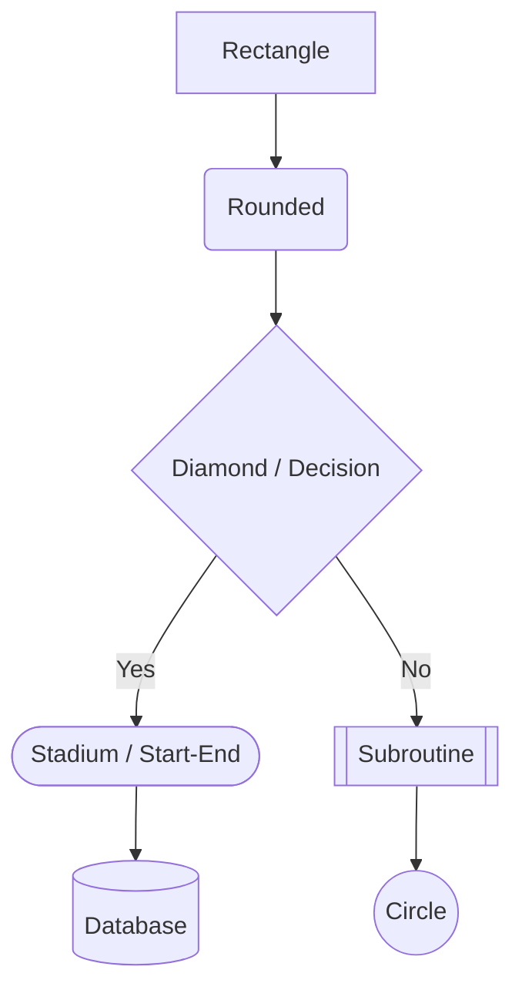
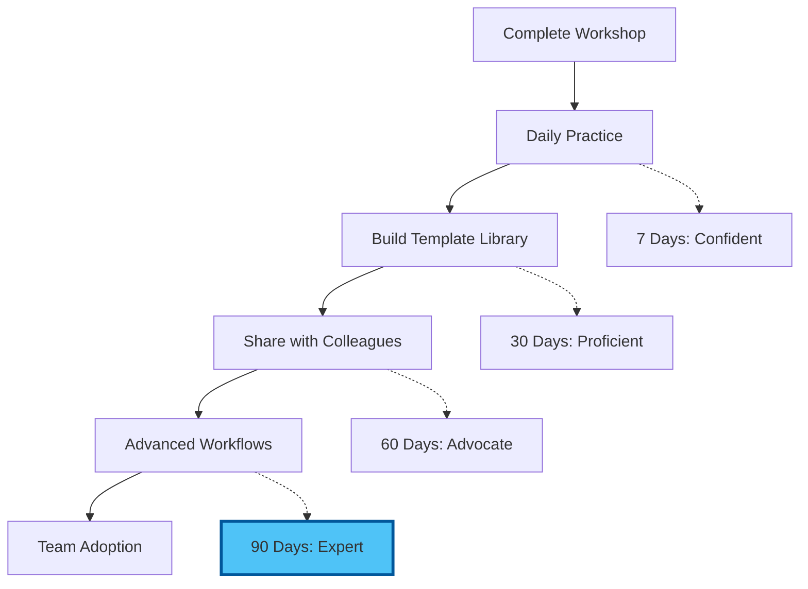

# Chapter 6: Resources & Continued Learning

## Introduction: Your Visual Version Control Library

This comprehensive resource collection supports your ongoing journey from documentation chaos to visual, version-controlled professionalism. Organised by topic and skill level.

---

## Mermaid Diagram Resources

### Official Documentation

- [Mermaid Official Docs](https://mermaid.js.org/intro/) — Complete syntax reference for every diagram type
- [Mermaid Live Editor](https://mermaid.live/) — Real-time browser-based editor with instant preview (bookmark this!)
- [Mermaid GitHub Repository](https://github.com/mermaid-js/mermaid) — Source code, issue tracker, and community discussions
- [Mermaid Syntax Reference](https://mermaid.js.org/syntax/flowchart.html) — Quick lookup for flowchart, Gantt, sequence, and more

### Diagram Type Guides

**Flowcharts:**
- [Mermaid Flowchart Syntax](https://mermaid.js.org/syntax/flowchart.html) — Nodes, edges, subgraphs, styling
- Useful for: Process documentation, decision trees, approval flows

**Gantt Charts:**
- [Mermaid Gantt Syntax](https://mermaid.js.org/syntax/gantt.html) — Tasks, sections, dependencies, milestones
- Useful for: Project planning, research timelines, roadmaps

**Sequence Diagrams:**
- [Mermaid Sequence Syntax](https://mermaid.js.org/syntax/sequenceDiagram.html) — Participants, messages, loops, alternatives
- Useful for: Workflow documentation, approval chains, system interactions

**Mind Maps:**
- [Mermaid Mind Map Syntax](https://mermaid.js.org/syntax/mindmap.html) — Hierarchical brainstorming layouts
- Useful for: Planning sessions, idea organisation, project scoping

**Entity-Relationship Diagrams:**
- [Mermaid ER Diagram Syntax](https://mermaid.js.org/syntax/entityRelationshipDiagram.html) — Entities, relationships, attributes
- Useful for: Data modelling, database design, system architecture

**State Diagrams:**
- [Mermaid State Diagram Syntax](https://mermaid.js.org/syntax/stateDiagram.html) — States, transitions, forks, joins
- Useful for: Process lifecycle, order tracking, document status workflows

### Mermaid Cheat Sheet

**Flowchart Quick Reference:**


**Styling Quick Reference:**
```
style A fill:#4fc3f7,stroke:#01579b,stroke-width:3px
style B fill:#e1f5fe
classDef highlight fill:#ffeb3b,stroke:#f57f17
class A,B highlight
```

**Link Types:**
```
A --> B       Solid line with arrow
A --- B       Solid line without arrow
A -.-> B      Dotted line with arrow
A ==> B       Thick line with arrow
A -->|text| B Labelled connection
```

### AI-Assisted Diagram Generation

**Using Claude Code to generate Mermaid diagrams:**

Claude Code (Anthropic's AI coding agent) can generate Mermaid diagrams from natural language descriptions. In your VS Code terminal:

```
Describe your process in plain English, and ask Claude Code to produce
the Mermaid syntax. For example:

"Create a Mermaid flowchart showing a job application process:
candidate applies, HR screens, if qualified then phone interview,
then on-site interview, then offer or rejection."
```

**Using GitHub Copilot for diagrams:**

If you have GitHub Copilot installed, type a comment describing the diagram and let Copilot auto-complete the Mermaid syntax:

```markdown
<!-- Create a Gantt chart for a 3-month marketing campaign -->
```

Copilot will suggest the complete Mermaid block.

---

## Git & Version Control Resources

### Official Documentation

- [Git Official Documentation](https://git-scm.com/doc) — Comprehensive reference manual
- [Git Reference Manual](https://git-scm.com/docs) — Command-by-command reference
- [Pro Git Book (Free)](https://git-scm.com/book/en/v2) — The definitive guide, available free online
- [GitHub Docs](https://docs.github.com/) — GitHub-specific features, workflows, and integrations

### Visual Learning Resources

**Beginner-Friendly:**
- [Learn Git Branching](https://learngitbranching.js.org/) — Interactive visual tutorial (highly recommended)
- [Git Immersion](https://gitimmersion.com/) — Guided tour of Git fundamentals
- [Atlassian Git Tutorials](https://www.atlassian.com/git/tutorials) — Clear explanations with diagrams

**Video Tutorials:**
- [Git and GitHub for Beginners - freeCodeCamp](https://www.youtube.com/watch?v=RGOj5yH7evk) — Comprehensive 1-hour introduction
- [Git Explained in 100 Seconds](https://www.youtube.com/watch?v=hwP7WQkmECE) — Quick conceptual overview
- [VS Code Git Integration Tutorial](https://www.youtube.com/watch?v=i_23KUAEtUM) — Visual Git in VS Code

### Git Cheat Sheet

**Essential Commands (for reference — VS Code handles these visually):**

```bash
# Setup
git init                          # Initialise a new repository
git clone <url>                   # Clone an existing repository

# Daily workflow
git status                        # See what's changed
git add <file>                    # Stage a file
git add .                         # Stage all changes
git commit -m "message"           # Commit with message
git push                          # Push to remote

# Branching
git branch <name>                 # Create a branch
git checkout <name>               # Switch to a branch
git checkout -b <name>            # Create and switch in one step
git merge <branch>                # Merge branch into current

# History
git log --oneline                 # Compact history
git diff                          # See unstaged changes
git diff --staged                 # See staged changes

# Undo
git reset --soft HEAD~1           # Undo last commit, keep changes
git stash                         # Temporarily shelve changes
git stash pop                     # Restore shelved changes
```

**Conventional Commit Types:**

| Type | Purpose | Example |
|------|---------|---------|
| `feat:` | New feature | `feat: add project timeline diagram` |
| `fix:` | Bug fix | `fix: correct Gantt chart date format` |
| `docs:` | Documentation | `docs: update README with setup instructions` |
| `style:` | Formatting | `style: improve diagram colour scheme` |
| `refactor:` | Restructure | `refactor: reorganise project folder layout` |
| `test:` | Testing | `test: add validation for diagram rendering` |
| `chore:` | Maintenance | `chore: update .gitignore for OS files` |

---

## VS Code Extensions for Visual Version Control

### Essential Extensions

**GitLens** (`eamodio.gitlens`)
- [Marketplace](https://marketplace.visualstudio.com/items?itemName=eamodio.gitlens)
- [Documentation](https://help.gitkraken.com/gitlens/gitlens-home/)
- Purpose: Inline blame, file history, commit graph, branch comparison
- Free tier covers everything in this workshop

**Markdown All in One** (`yzhang.markdown-all-in-one`)
- [Marketplace](https://marketplace.visualstudio.com/items?itemName=yzhang.markdown-all-in-one)
- Purpose: Markdown editing, table of contents, preview, shortcuts

**Mermaid Markdown** (`bierner.markdown-mermaid`)
- [Marketplace](https://marketplace.visualstudio.com/items?itemName=bierner.markdown-mermaid)
- Purpose: Renders Mermaid diagrams in VS Code's Markdown preview

### Recommended Extensions

**Git Graph** (`mhutchie.git-graph`)
- [Marketplace](https://marketplace.visualstudio.com/items?itemName=mhutchie.git-graph)
- Purpose: Beautiful, interactive repository visualisation
- Complements GitLens for understanding branch structures

**GitHub Pull Requests and Issues** (`GitHub.vscode-pull-request-github`)
- [Marketplace](https://marketplace.visualstudio.com/items?itemName=GitHub.vscode-pull-request-github)
- Purpose: Create and review pull requests without leaving VS Code

**Markdown Preview Mermaid Support** (`bierner.markdown-mermaid`)
- [Marketplace](https://marketplace.visualstudio.com/items?itemName=bierner.markdown-mermaid)
- Purpose: Live Mermaid diagram rendering in the preview pane

**Code Spell Checker** (`streetsidesoftware.code-spell-checker`)
- [Marketplace](https://marketplace.visualstudio.com/items?itemName=streetsidesoftware.code-spell-checker)
- Purpose: Catch spelling errors in documentation (supports British English)

### Optional Power-User Extensions

**Mermaid Editor** (`tomoyukim.vscode-mermaid-editor`)
- Live side-by-side Mermaid editing and preview

**Markdown PDF** (`yzane.markdown-pdf`)
- Export Markdown (with diagrams) to PDF, HTML, or PNG

**Draw.io Integration** (`hediet.vscode-drawio`)
- Full Draw.io diagram editor embedded in VS Code

**Markdownlint** (`davidanson.vscode-markdownlint`)
- Enforces consistent Markdown style

### Installation Commands

Install all essential and recommended extensions in one go:

```bash
code --install-extension eamodio.gitlens \
     --install-extension yzhang.markdown-all-in-one \
     --install-extension bierner.markdown-mermaid \
     --install-extension mhutchie.git-graph \
     --install-extension GitHub.vscode-pull-request-github \
     --install-extension streetsidesoftware.code-spell-checker
```

---

## GitHub Resources

### Getting Started

- [GitHub Quickstart](https://docs.github.com/en/get-started/quickstart) — Official beginner guide
- [GitHub Skills](https://skills.github.com/) — Free interactive courses directly on GitHub
- [GitHub Flow Guide](https://docs.github.com/en/get-started/using-github/github-flow) — The branching workflow we use

### GitHub Pages (Free Website Hosting)

- [GitHub Pages Documentation](https://docs.github.com/en/pages) — Host websites from your repositories
- [Quickstart for GitHub Pages](https://docs.github.com/en/pages/quickstart) — Your first site in minutes
- Mermaid diagrams render automatically on GitHub Pages and in GitHub's Markdown viewer

### Collaboration Features

- [About Pull Requests](https://docs.github.com/en/pull-requests/collaborating-with-pull-requests/proposing-changes-to-your-work-with-pull-requests/about-pull-requests) — How to propose and review changes
- [About Issues](https://docs.github.com/en/issues/tracking-your-work-with-issues/about-issues) — Task tracking and project management
- [GitHub Projects](https://docs.github.com/en/issues/planning-and-tracking-with-projects) — Kanban boards and project planning

---

## Learning Paths

### Beginner Path (Weeks 1-2)

**Week 1: Mermaid Mastery**
- [ ] Create one flowchart per day from a real process
- [ ] Build a Gantt chart for your current project
- [ ] Write a sequence diagram for a work interaction
- [ ] Experiment with mind maps for meeting preparation
- [ ] Bookmark the Mermaid Live Editor for daily use

**Resources:**
- [Mermaid Live Editor](https://mermaid.live/) — Practice here daily
- [Mermaid Official Tutorial](https://mermaid.js.org/intro/) — Work through each diagram type

**Week 2: Git Confidence**
- [ ] Commit every document change (aim for 3+ commits per day)
- [ ] Create a feature branch for a new piece of work
- [ ] Push at least one repository to GitHub
- [ ] Use GitLens to review your growing commit history
- [ ] Write commit messages that explain "why" not just "what"

**Resources:**
- [Learn Git Branching](https://learngitbranching.js.org/) — Interactive practice
- [Conventional Commits](https://www.conventionalcommits.org/) — Message format reference

### Intermediate Path (Weeks 3-4)

**Week 3: Integration**
- [ ] Combine diagrams and version control in a real project
- [ ] Use Git branches to experiment with different diagram approaches
- [ ] Create a team handbook or process documentation repository
- [ ] Share a repository with a colleague for collaboration
- [ ] Explore Mermaid theming and advanced styling

**Resources:**
- [Mermaid Theming](https://mermaid.js.org/config/theming.html) — Custom colour schemes
- [GitHub Collaboration Guide](https://docs.github.com/en/get-started/exploring-projects-on-github/contributing-to-a-project) — Working with others

**Week 4: Automation**
- [ ] Set up a `.gitignore` file for your projects
- [ ] Explore pre-commit hooks for documentation quality
- [ ] Use Claude Code or GitHub Copilot to generate diagrams from descriptions
- [ ] Create reusable Mermaid templates for common diagram types
- [ ] Build a personal wiki or knowledge base in a Git repository

**Resources:**
- [gitignore Templates](https://github.com/github/gitignore) — Standard ignore patterns
- [Pre-commit Framework](https://pre-commit.com/) — Automated quality checks

### Advanced Path (Month 2+)

**Advanced Skills:**
- [ ] Interactive rebase for clean commit history
- [ ] Git bisect for finding when changes were introduced
- [ ] GitHub Actions for automated documentation builds
- [ ] Custom Mermaid themes matching your organisation's brand
- [ ] Contributing to open-source documentation projects

**Resources:**
- [GitHub Actions Documentation](https://docs.github.com/en/actions) — Automation pipelines
- [Advanced Git (Atlassian)](https://www.atlassian.com/git/tutorials/advanced-overview) — Rebase, cherry-pick, bisect

---

## Tools & Utilities

### Diagram Tools

**Browser-Based:**
- [Mermaid Live Editor](https://mermaid.live/) — Primary tool for Mermaid diagrams
- [Draw.io / diagrams.net](https://app.diagrams.net/) — Free diagramming for complex visuals
- [Excalidraw](https://excalidraw.com/) — Hand-drawn style diagrams, Git-friendly JSON format

**Desktop Applications:**
- [GitHub Desktop](https://desktop.github.com/) — Visual Git client for those who prefer a standalone app
- [GitKraken](https://www.gitkraken.com/) — Advanced Git visualisation (free for public repos)

### Export & Conversion

**Mermaid to Image:**
- [Mermaid CLI](https://github.com/mermaid-js/mermaid-cli) — Command-line export to PNG, SVG, PDF
  ```bash
  npm install -g @mermaid-js/mermaid-cli
  mmdc -i input.md -o output.png
  ```
- The Mermaid Live Editor also offers direct PNG/SVG download

**Markdown to PDF:**
- [Pandoc](https://pandoc.org/) — Universal document converter (supports Mermaid with filters)
- VS Code extension: Markdown PDF (`yzane.markdown-pdf`)

**Markdown to Slides:**
- [Marp](https://marp.app/) — Create presentations from Markdown (supports Mermaid)
- VS Code extension: Marp for VS Code (`marp-team.marp-vscode`)

---

## Configuration Templates

### Recommended VS Code Settings for Documentation

Add these to your `settings.json` (`Ctrl+,` then click the `{}` icon):

```json
{
  "editor.wordWrap": "on",
  "editor.minimap.enabled": false,
  "editor.fontSize": 14,
  "editor.lineHeight": 1.6,
  "markdown.preview.fontSize": 16,
  "gitlens.currentLine.enabled": true,
  "gitlens.currentLine.format": "${author}, ${date} - ${message}",
  "gitlens.codeLens.enabled": true,
  "gitlens.hovers.currentLine.over": "line",
  "git.enableSmartCommit": true,
  "git.confirmSync": false,
  "git.autofetch": true,
  "files.autoSave": "afterDelay",
  "files.autoSaveDelay": 1000,
  "cSpell.language": "en-GB"
}
```

### Recommended .gitignore for Documentation Projects

```gitignore
# OS files
.DS_Store
Thumbs.db
Desktop.ini

# Editor files
.vscode/settings.json
*.swp
*~

# Build outputs
*.pdf
*.png
/dist/
/build/

# Dependencies
node_modules/

# Secrets (never commit these)
.env
.env.local
*.key
```

---

## Community & Support

### Forums & Communities

**Git & GitHub:**
- [GitHub Community Forum](https://github.community/) — Official discussion forum
- [Reddit r/git](https://reddit.com/r/git) — Community discussions and help
- [Stack Overflow — Git](https://stackoverflow.com/questions/tagged/git) — Q&A for specific issues

**Mermaid:**
- [Mermaid GitHub Discussions](https://github.com/mermaid-js/mermaid/discussions) — Feature requests and help
- [Mermaid Discord](https://discord.gg/AJmKKk6Jrg) — Community chat

**VS Code:**
- [VS Code Discord](https://aka.ms/vscode-discord) — Official community
- [Reddit r/vscode](https://reddit.com/r/vscode) — Tips, extensions, and workflows

### Newsletters & Blogs

- [GitHub Blog](https://github.blog/) — Product updates and best practices
- [VS Code Blog](https://code.visualstudio.com/blogs) — Monthly release notes and tips
- [GitKraken Blog](https://www.gitkraken.com/blog) — Visual Git tutorials and workflows
- [Conventional Commits](https://www.conventionalcommits.org/) — Commit message standard

### Workshop Support

- Workshop Discord channel — Ask questions and share wins
- Email: workshop@dreamlab.ai
- Office Hours: Fridays 2-3pm GMT
- Documentation: This website

---

## Troubleshooting Guide

### Mermaid Issues

**Diagram not rendering in preview:**
1. Verify `bierner.markdown-mermaid` extension is installed
2. Check syntax at [Mermaid Live Editor](https://mermaid.live/) — paste your code to find errors
3. Ensure the code block uses ` ```mermaid ` (not ` ```mermaid-js ` or similar)
4. Reload VS Code: `Ctrl+Shift+P` > "Developer: Reload Window"

**Syntax errors:**
- Node IDs cannot contain spaces — use `A[Label with spaces]` not `A Label`
- Arrow syntax: `-->` (not `->` or `=>`)
- Decision diamonds use `{curly braces}` not `<angle brackets>`
- Gantt dates must match the `dateFormat` specified

### Git Issues

**"Not a git repository" error:**
```bash
# Verify you're in the right folder
pwd
# Initialise if needed
git init
```

**Git not found after installation:**
- Restart VS Code completely (close all windows)
- On Windows: Ensure "Add to PATH" was selected during Git installation
- Verify: Open terminal and run `git --version`

**Push rejected (authentication):**
- GitHub now requires personal access tokens, not passwords
- Create a token: GitHub > Settings > Developer settings > Personal access tokens
- Or use GitHub CLI: `gh auth login`

**Merge conflict:**
1. Open the conflicted file — VS Code highlights the conflict
2. Choose: "Accept Current", "Accept Incoming", "Accept Both", or edit manually
3. Stage the resolved file and commit

**Accidentally committed to wrong branch:**
```bash
# Create a new branch with your changes
git branch correct-branch
# Reset current branch
git reset --hard HEAD~1
# Switch to the correct branch
git checkout correct-branch
```

### Performance Issues

**VS Code slow with large repositories:**
```json
{
  "git.autoRepositoryDetection": "subFolders",
  "gitlens.advanced.repositorySearchDepth": 1,
  "files.watcherExclude": {
    "**/.git/objects/**": true,
    "**/node_modules/**": true
  }
}
```

---

## Quick Reference Cards

### Daily Git Workflow

```
Morning:
  git pull origin main        (get latest changes)

During work:
  [edit files]
  git add <files>             (stage changes)
  git commit -m "type: msg"   (save snapshot)

End of day:
  git push                    (backup to GitHub)
```

### Mermaid Diagram Decision Guide

| Need to show... | Use this diagram |
|-----------------|-----------------|
| A process or decision flow | `flowchart TD` |
| A project timeline | `gantt` |
| How things interact over time | `sequenceDiagram` |
| Brainstorming or categories | `mindmap` |
| Data relationships | `erDiagram` |
| States and transitions | `stateDiagram-v2` |
| Distribution or proportions | `pie` |

### Essential Keyboard Shortcuts

```
+------------------------------------------+
|    VISUAL VERSION CONTROL SHORTCUTS       |
+------------------------------------------+
| Source Control     Ctrl+Shift+G           |
| Commit changes     Ctrl+Enter             |
| Markdown preview   Ctrl+Shift+V           |
| Command Palette    Ctrl+Shift+P           |
| Terminal           Ctrl+`                 |
| GitLens Graph      Ctrl+Shift+P >         |
|                    "Show Commit Graph"     |
| File History       Ctrl+Shift+P >         |
|                    "Show File History"     |
| Branch switch      Click branch in        |
|                    status bar              |
+------------------------------------------+
```

---

## Your Learning Journey



## Next Steps

### Today

- [ ] Push your workshop project to GitHub
- [ ] Bookmark the Mermaid Live Editor
- [ ] Create one diagram for tomorrow's first meeting

### This Week

- [ ] Use Git for all document work (commit daily)
- [ ] Create 5 different Mermaid diagrams for real tasks
- [ ] Explore one new diagram type you haven't tried
- [ ] Share a diagram with a colleague

### This Month

- [ ] Build a reusable diagram template library
- [ ] Establish Git as your default for all projects
- [ ] Help one colleague get started with these tools
- [ ] Create a team documentation repository

---

## Conclusion

Your transformation from manual documentation to visual, version-controlled workflows doesn't end with this workshop — it begins here. The tools you've learned today will compound in value every time you create a diagram in seconds instead of hours, every time Git saves you from lost work, and every time a colleague can understand your process at a glance.

**Remember:**
- The Mermaid Live Editor is your best friend for experimentation
- Commit early, commit often, push before you leave
- Every diagram you create saves future meetings and explanations
- Version control is not just for developers — it's for anyone who values their work

---

**Workshop Complete!**

[Back to Assessment](./05_assessment.md) | [Back to Module Overview](README.md)
