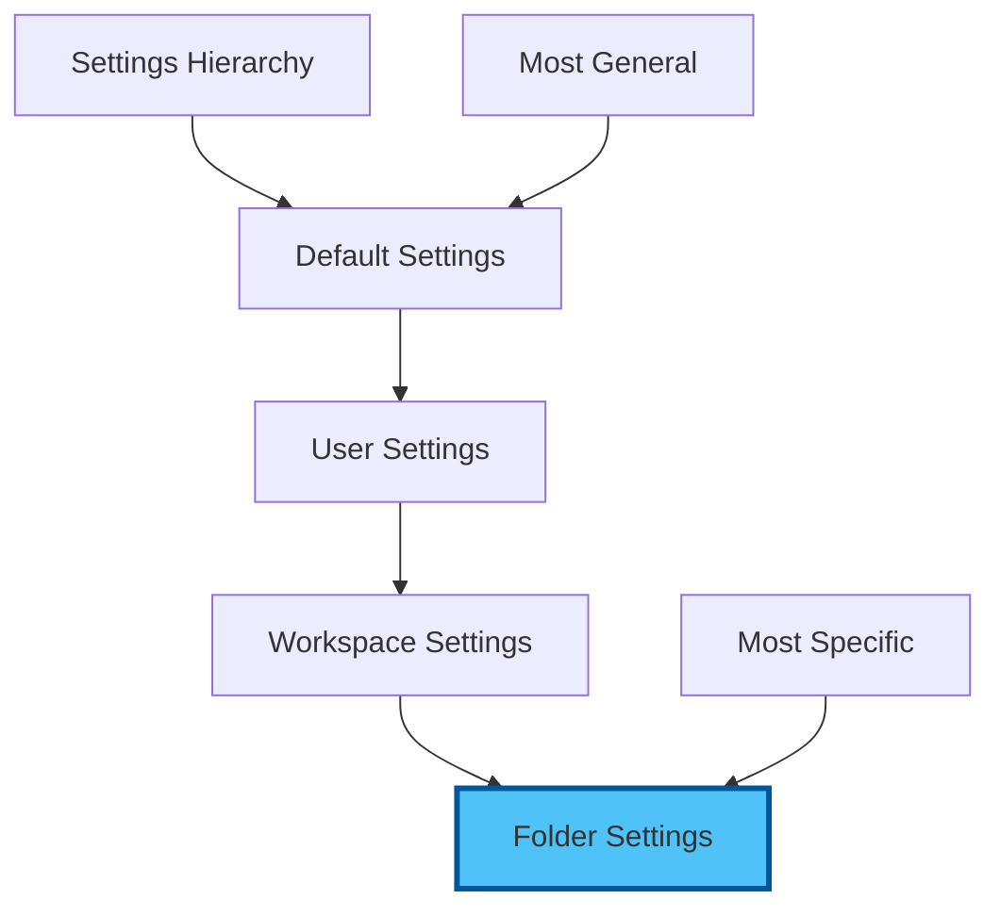

# Chapter 2: Hands-On Setup - Building Your AI-Enhanced Command Centre

⏱️ **Estimated Time**: 90 minutes
🎯 **Difficulty**: Beginner
📋 **Prerequisites**: VS Code installed, internet connection

## Your Transformation Journey

By the end of this hands-on session, you'll have a production-ready development environment with AI coding assistants, modern tooling, and professional workflows.


---

## 2.1 Essential Extensions 2025

### 🤖 AI Coding Assistants

#### 1. GitHub Copilot (Premium, Recommended)

💡 **Best for**: Production code, enterprise teams, comprehensive AI pair programming

```
Extension ID: GitHub.copilot
Features:
  - Inline code suggestions
  - Chat interface
  - Context-aware completions
  - 50+ language support
Cost: $10/month ($100/year for individuals)
```

**Installation:**
1. Open Extensions (`Ctrl+Shift+X`)
2. Search: "GitHub Copilot"
3. Click **Install**
4. Sign in with GitHub account
5. Activate subscription

**Quick Test:**
```javascript
// Type this comment and press Enter:
// Function to calculate fibonacci sequence

// Copilot will suggest complete implementation!
```

#### 2. Claude Dev (Anthropic's Official Extension)

💡 **Best for**: Complex reasoning, refactoring, documentation

```
Extension ID: saoudrizwan.claude-dev
Features:
  - Chat with Claude 3.5 Sonnet
  - Edit files directly
  - Terminal command execution
  - Multi-file awareness
Cost: Pay-per-use (Anthropic API)
```

**Setup:**
1. Install extension
2. Get API key from [console.anthropic.com](https://console.anthropic.com)
3. `Ctrl+Shift+P` → "Claude Dev: Set API Key"
4. Start chatting in sidebar!

#### 3. Continue (Open Source AI)

💡 **Best for**: Free tier, multiple model support, customization

```
Extension ID: Continue.continue
Features:
  - Free tier with Groq/Gemini
  - Support for 20+ AI models
  - Tab autocomplete
  - Custom model integration
Cost: FREE (with free API keys)
```

**Configuration for 2025:**
```json
{
  "models": [
    {
      "title": "Claude 3.5 Sonnet",
      "provider": "anthropic",
      "model": "claude-3-5-sonnet-20241022",
      "apiKey": "YOUR_KEY"
    },
    {
      "title": "GPT-4 Turbo",
      "provider": "openai",
      "model": "gpt-4-turbo-preview",
      "apiKey": "YOUR_KEY"
    },
    {
      "title": "Gemini 2.0 Flash (FREE)",
      "provider": "gemini",
      "model": "gemini-2.0-flash",
      "apiKey": "YOUR_FREE_KEY"
    }
  ],
  "tabAutocompleteModel": {
    "title": "Gemini Flash",
    "provider": "gemini",
    "model": "gemini-2.0-flash"
  }
}
```

#### 4. Cody by Sourcegraph

💡 **Best for**: Codebase understanding, large context windows

```
Extension ID: sourcegraph.cody-ai
Features:
  - Free tier: 500 completions/month
  - Understands entire codebase
  - Smart code search
  - Multi-repo awareness
Cost: FREE tier, Pro $9/month
```

<details>
<summary>🎯 <strong>Exercise: AI Assistant Speed Test</strong></summary>

**Try this with each AI assistant:**

1. Create `test-ai.js`
2. Type: `// Create a React component for a todo list with add/delete`
3. Press `Tab` or `Ctrl+I`
4. Compare speed and quality!

**Expected Results:**
- **Copilot**: Instant, high quality
- **Claude Dev**: Thoughtful, well-documented
- **Continue**: Fast with free models
- **Cody**: Context-aware suggestions

</details>

---

### 🛠️ Essential Productivity Extensions

#### 5. GitLens — Git Supercharged

```
Extension ID: eamodio.gitlens
Why: See who changed what, when, and why
Features:
  - Inline blame annotations
  - File history
  - Visual commit graph
  - Compare branches
```

#### 6. Error Lens

```
Extension ID: usernamehw.errorlens
Why: See errors INLINE immediately
Before: Hover to see error
After: Error displayed directly in editor
```

#### 7. TODO Highlight

```
Extension ID: wayou.vscode-todo-highlight
Why: Never lose track of TODOs
Highlights: TODO, FIXME, NOTE, HACK
```

#### 8. Live Server

```
Extension ID: ritwickdey.LiveServer
Why: Instant preview for HTML/web projects
Launch: Right-click HTML → "Open with Live Server"
```

#### 9. Prettier - Code Formatter

```
Extension ID: esbenp.prettier-vscode
Why: Auto-format on save
Supports: JavaScript, TypeScript, HTML, CSS, JSON, Markdown
```

#### 10. Path Intellisense

```
Extension ID: christian-kohler.path-intellisense
Why: Autocomplete file paths
Super useful for: imports, links, images
```

📝 **Quick Install All:**
```bash
# Copy-paste into terminal (Ctrl+`)
code --install-extension GitHub.copilot
code --install-extension saoudrizwan.claude-dev
code --install-extension Continue.continue
code --install-extension sourcegraph.cody-ai
code --install-extension eamodio.gitlens
code --install-extension usernamehw.errorlens
code --install-extension wayou.vscode-todo-highlight
code --install-extension ritwickdey.LiveServer
code --install-extension esbenp.prettier-vscode
code --install-extension christian-kohler.path-intellisense
```

---

## 2.2 Settings & Configuration for AI Coding

### Essential settings.json Configuration

Open Settings JSON: `Ctrl+Shift+P` → "Preferences: Open User Settings (JSON)"

```json
{
  // Editor Settings
  "editor.fontSize": 14,
  "editor.lineHeight": 22,
  "editor.fontFamily": "'Fira Code', 'Cascadia Code', Consolas, monospace",
  "editor.fontLigatures": true,
  "editor.wordWrap": "on",
  "editor.minimap.enabled": true,
  "editor.formatOnSave": true,
  "editor.defaultFormatter": "esbenp.prettier-vscode",

  // AI Coding Settings
  "github.copilot.enable": {
    "*": true,
    "markdown": true,
    "plaintext": true
  },
  "github.copilot.editor.enableAutoCompletions": true,

  // Inline Suggestions (works with all AI)
  "editor.inlineSuggest.enabled": true,
  "editor.suggestSelection": "first",
  "editor.quickSuggestions": {
    "other": true,
    "comments": true,
    "strings": true
  },

  // File Management
  "files.autoSave": "afterDelay",
  "files.autoSaveDelay": 1000,
  "files.trimTrailingWhitespace": true,
  "files.insertFinalNewline": true,

  // Git Integration
  "git.enableSmartCommit": true,
  "git.confirmSync": false,
  "git.autofetch": true,
  "gitlens.currentLine.enabled": true,

  // Terminal
  "terminal.integrated.fontSize": 13,
  "terminal.integrated.defaultProfile.windows": "Git Bash",

  // Error Lens
  "errorLens.enabled": true,
  "errorLens.enabledDiagnosticLevels": ["error", "warning"],

  // Prettier
  "prettier.singleQuote": true,
  "prettier.semi": true,
  "prettier.tabWidth": 2,

  // Security
  "security.workspace.trust.enabled": true,

  // Performance
  "files.exclude": {
    "**/.git": true,
    "**/node_modules": true,
    "**/.DS_Store": true
  }
}
```

💡 **Tip**: Copy this entire JSON block and paste into your settings!

---

## 2.3 Keyboard Shortcuts for Productivity

### Essential Shortcuts (2025 Edition)

| Action | Windows/Linux | Mac | Description |
|--------|--------------|-----|-------------|
| **AI Chat** | `Ctrl+I` | `Cmd+I` | Open inline AI chat |
| **Copilot Panel** | `Ctrl+Shift+I` | `Cmd+Shift+I` | Open Copilot sidebar |
| **Command Palette** | `Ctrl+Shift+P` | `Cmd+Shift+P` | Access all commands |
| **Quick Open** | `Ctrl+P` | `Cmd+P` | Open file by name |
| **Terminal** | `Ctrl+`` | `Ctrl+`` | Toggle terminal |
| **Multi-cursor** | `Alt+Click` | `Option+Click` | Edit multiple lines |
| **Format Document** | `Shift+Alt+F` | `Shift+Option+F` | Auto-format |
| **Go to Definition** | `F12` | `F12` | Jump to code |
| **Rename Symbol** | `F2` | `F2` | Rename everywhere |

<details>
<summary>🎯 <strong>Exercise: Keyboard Shortcut Challenge</strong></summary>

**Complete these tasks using ONLY keyboard shortcuts:**

1. Open Command Palette
2. Create new file
3. Ask AI to generate a function
4. Format the code
5. Open terminal
6. Save file

**Time yourself!** Goal: <30 seconds

</details>

---

## 2.4 Remote Development Setup

### SSH, Containers, and WSL

#### Option 1: Remote - SSH

💡 **Best for**: Working on remote servers, cloud instances

```
Extension: ms-vscode-remote.remote-ssh

Use cases:
- Edit files on Linux servers
- Develop on cloud VMs
- Access remote dev environments
```

#### Option 2: Dev Containers

💡 **Best for**: Consistent environments, team projects

```
Extension: ms-vscode-remote.remote-containers

Benefits:
- Project-specific environments
- Shareable configurations
- No "works on my machine"
```

**Quick Start Dev Container:**

Create `.devcontainer/devcontainer.json`:
```json
{
  "name": "Node.js AI Dev",
  "image": "mcr.microsoft.com/devcontainers/javascript-node:20",
  "features": {
    "ghcr.io/devcontainers/features/github-cli:1": {}
  },
  "customizations": {
    "vscode": {
      "extensions": [
        "GitHub.copilot",
        "Continue.continue",
        "esbenp.prettier-vscode"
      ]
    }
  },
  "postCreateCommand": "npm install",
  "forwardPorts": [3000]
}
```

#### Option 3: WSL (Windows Only)

💡 **Best for**: Windows users wanting Linux environment

```
Extension: ms-vscode-remote.remote-wsl

Setup:
1. Install WSL2
2. Install VS Code WSL extension
3. Open folder in WSL
4. Full Linux + VS Code integration!
```

---

## 2.5 Workspace vs User Settings

### Understanding the Hierarchy



### When to Use Each

**User Settings** (`.config/Code/User/settings.json`):
- Personal preferences
- AI API keys
- Theme and font choices
- Applies to ALL projects

**Workspace Settings** (`.vscode/settings.json`):
- Project-specific config
- Team formatting rules
- Language-specific settings
- Committed to Git

**Example Workspace Settings:**
```json
{
  "editor.formatOnSave": true,
  "editor.defaultFormatter": "esbenp.prettier-vscode",
  "[javascript]": {
    "editor.tabSize": 2
  },
  "[python]": {
    "editor.tabSize": 4,
    "editor.defaultFormatter": "ms-python.black-formatter"
  },
  "files.exclude": {
    "**/__pycache__": true,
    "**/node_modules": true
  }
}
```

<details>
<summary>⚠️ <strong>Warning: API Keys in Settings</strong></summary>

**NEVER commit API keys to workspace settings!**

❌ **Bad** (workspace settings):
```json
{
  "anthropic.apiKey": "sk-ant-xxx"
}
```

✅ **Good** (user settings):
```json
{
  "anthropic.apiKey": "sk-ant-xxx"
}
```

Or use environment variables:
```json
{
  "anthropic.apiKey": "${env:ANTHROPIC_API_KEY}"
}
```

</details>

---

## 2.6 Project Setup Best Practices

### Professional Project Structure

```
my-project/
├── .vscode/
│   ├── settings.json       # Team settings
│   ├── extensions.json     # Recommended extensions
│   └── launch.json         # Debug configurations
├── .devcontainer/
│   └── devcontainer.json   # Container config
├── src/
│   └── index.js
├── tests/
│   └── index.test.js
├── docs/
│   └── README.md
├── .gitignore
├── .prettierrc
└── package.json
```

### Recommended Extensions File

Create `.vscode/extensions.json`:
```json
{
  "recommendations": [
    "github.copilot",
    "continue.continue",
    "eamodio.gitlens",
    "esbenp.prettier-vscode",
    "usernamehw.errorlens"
  ]
}
```

💡 **When teammates open the project**, VS Code will suggest installing these!

---

## 2.7 AI Coding Best Practices

### Getting the Most from AI Assistants

#### 1. Write Clear Comments

❌ **Vague**:
```javascript
// make function
```

✅ **Specific**:
```javascript
// Create async function that fetches user data from API,
// handles errors with try-catch, and returns formatted user object
```

#### 2. Use AI Chat for Planning

```
You: "I need to build a REST API for user authentication"

Claude Dev:
1. First, let's plan the architecture
2. We'll need these endpoints: /register, /login, /logout
3. Here's the file structure I recommend...
4. Let's start with...
```

#### 3. Iterate and Refine

```
You: "Make this function more efficient"
AI: [suggests optimization]

You: "Add error handling"
AI: [adds try-catch]

You: "Add JSDoc comments"
AI: [adds documentation]
```

#### 4. Use AI for Learning

```
You: "Explain this code line by line"
You: "What's a better way to do this?"
You: "What are the edge cases I should test?"
```

---

## 2.8 Verification Checklist

### Confirm Your Setup

- [ ] VS Code installed and updated
- [ ] At least one AI assistant working
- [ ] GitLens showing file history
- [ ] Error Lens displaying inline
- [ ] Auto-save enabled
- [ ] Format on save working
- [ ] Terminal accessible
- [ ] Project structure created
- [ ] Can use `Ctrl+I` for AI chat
- [ ] Keyboard shortcuts working

### Quick AI Test

Create `test.js`:
```javascript
// Type this and let AI complete:
// Function to validate email address with regex

// Expected: AI generates complete validation function
```

---

## 2.9 Common Issues & Solutions

### AI Assistant Not Working

**Issue**: No AI suggestions appearing

**Solutions**:
1. Check API key: `Ctrl+Shift+P` → "Settings" → Search "api key"
2. Verify internet connection
3. Reload window: `Ctrl+Shift+P` → "Reload Window"
4. Check extension logs: Output panel → Select extension

### Format On Save Not Working

**Issue**: File doesn't format when saving

**Solutions**:
1. Verify Prettier is default formatter:
   ```json
   "editor.defaultFormatter": "esbenp.prettier-vscode"
   ```
2. Check format on save enabled:
   ```json
   "editor.formatOnSave": true
   ```
3. Install language-specific formatter

### Extensions Slow

**Issue**: VS Code feels sluggish

**Solutions**:
1. Disable unused extensions
2. Check extension performance: `Ctrl+Shift+P` → "Developer: Show Running Extensions"
3. Increase memory limit:
   ```json
   "extensions.experimental.useUtilityProcess": true
   ```

---

## 🎉 Achievement Unlocked!

**You now have:**
✅ Production-ready VS Code environment
✅ Multiple AI coding assistants
✅ Professional settings and shortcuts
✅ Remote development capabilities
✅ Best practices workflow

### Next Steps

1. **Practice** keyboard shortcuts daily
2. **Experiment** with different AI assistants
3. **Customize** settings to your preferences
4. **Explore** extensions marketplace
5. **Share** your setup with `.vscode/extensions.json`

---

**Pro Tips:**

💡 Switch AI models based on task:
- **Quick fixes**: Gemini Flash (free & fast)
- **Complex logic**: Claude 3.5 Sonnet (best reasoning)
- **Production code**: GitHub Copilot (enterprise quality)

📝 Create keyboard shortcut cheat sheet and pin it near monitor

🚀 **You're now equipped like a professional developer!**

---

**Next**: [Chapter 3: Practical Exercises](./03_exercises.md)

[Back to Concepts](./01_concepts.md) | [Back to Module Overview](README.md)
