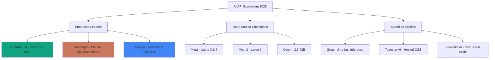
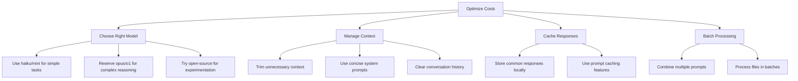
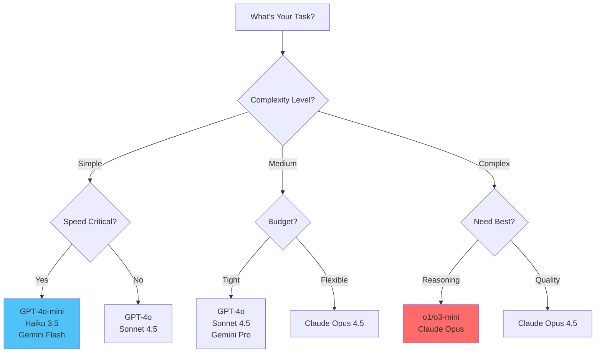

# Chapter 1: Core Concepts - Understanding AI APIs in 2025

## The Modern AI API Landscape

The AI API ecosystem has matured dramatically. Understanding these fundamentals empowers you to harness cutting-edge models with precision and control.

💡 **Tip**: Think of APIs as your direct line to the world's most powerful AI models—no intermediaries, no limitations.



## What Is an API? (The Simple Truth)

### The Restaurant Analogy 🍽️

An API is like ordering at a restaurant:

- **You (Client)**: Place your order (send a request)
- **Waiter (API)**: Takes order, brings food (handles communication)
- **Kitchen (AI Model)**: Prepares your meal (processes your request)

You don't need to know how the kitchen works—just order what you want and receive results.

### Technical Definition (For the Curious)

An **API (Application Programming Interface)** allows software to communicate. For AI services:

```mermaid
sequenceDiagram
    participant You as Your Application
    participant API as AI Provider API
    participant Model as AI Model

    You->>API: HTTP Request + Prompt
    Note over You,API: Authorization: Bearer YOUR_API_KEY
    API->>Model: Process request
    Model->>Model: Generate response
    Model->>API: Return completion
    API->>You: HTTP Response + Text
    Note over You,API: Usage: 1,247 tokens • Cost: $0.003
```



⚠️ **Warning**: Never share your API keys publicly—treat them like passwords!

## REST APIs: The Universal Language

### What is REST?

**REST (Representational State Transfer)** is how web services talk:

- Uses HTTP methods: `GET`, `POST`, `PUT`, `DELETE`
- Stateless: Each request is independent
- Returns structured data (JSON format)

### Anatomy of an AI API Request

```bash
curl https://api.openai.com/v1/chat/completions \
  -H "Content-Type: application/json" \
  -H "Authorization: Bearer YOUR_API_KEY" \
  -d '{
    "model": "gpt-4o",
    "messages": [
      {
        "role": "system",
        "content": "You are a helpful AI assistant."
      },
      {
        "role": "user",
        "content": "Explain quantum computing in simple terms"
      }
    ],
    "temperature": 0.7,
    "max_tokens": 500
  }'
```

**Breaking it down:**
- **Endpoint**: Where to send the request
- **Headers**: Authentication and content type
- **Body**: Your configuration and prompt
- **Response**: JSON with AI-generated text

📝 **Note**: Most developers use SDKs (libraries) that handle this complexity for you.

## Authentication: API Keys Explained

### What is an API Key?

Your API key is your unique identifier—like a password that:
- Authenticates your requests
- Tracks your usage
- Enables billing
- Sets rate limits

```mermaid
graph LR
    A[Your Request] --> B{API Key Valid?}
    B -->|Yes ✅| C[Process Request]
    B -->|No ❌| D[401 Unauthorized]
    C --> E[Return Response]
    C --> F[Log Usage]
    F --> G[Update Billing]
```



### API Key Security Best Practices (2025 Edition)

**DO:**
✅ Store keys in environment variables (`.env` files)
✅ Use secrets managers (AWS Secrets Manager, 1Password)
✅ Rotate keys every 90 days
✅ Set spending limits on all accounts
✅ Enable MFA on provider accounts
✅ Use separate keys for dev/prod environments

**DON'T:**
❌ Hardcode keys in source code
❌ Commit keys to Git repositories
❌ Share keys in Slack/Discord/email
❌ Use the same key across all projects
❌ Skip setting up budget alerts

### Example: Secure Key Management

```python
# ❌ WRONG - Never do this!
api_key = "sk-proj-abc123xyz..."

# ✅ CORRECT - Use environment variables
import os
from dotenv import load_dotenv

load_dotenv()
api_key = os.getenv("OPENAI_API_KEY")

if not api_key:
    raise ValueError("Missing OPENAI_API_KEY environment variable")
```

```typescript
// ✅ TypeScript/Node.js example
import * as dotenv from 'dotenv';
dotenv.config();

const apiKey = process.env.OPENAI_API_KEY;
if (!apiKey) {
  throw new Error('Missing OPENAI_API_KEY');
}
```

```bash
# .env file (NEVER commit this!)
OPENAI_API_KEY=sk-proj-abc123...
ANTHROPIC_API_KEY=sk-ant-api03-xyz...
GEMINI_API_KEY=AIzaSy...
```

## Token Economics: Understanding Costs

### What Are Tokens? 🪙

Tokens are pieces of text. Think of them as:
- **~4 characters** per token
- **~0.75 words** per token
- Both input AND output count

**Example:**
```
"Hello, how are you today?" = 6 tokens
"I am doing great, thanks for asking!" = 8 tokens
Total conversation cost = 14 tokens
```

💡 **Tip**: Use [OpenAI's tokenizer](https://platform.openai.com/tokenizer) to see exact token counts.

### 2025 Pricing Comparison (USD per 1M tokens)

| Provider | Model | Input | Output | Context | Best For |
|----------|-------|--------|---------|---------|----------|
| **OpenAI** | GPT-4o | $2.50 | $10.00 | 128K | General purpose |
| | GPT-4o-mini | $0.15 | $0.60 | 128K | High volume |
| | o1 | $15.00 | $60.00 | 200K | Complex reasoning |
| | o3-mini | $1.10 | $4.40 | 200K | Fast reasoning |
| **Anthropic** | Claude Opus 4.5 | $15.00 | $75.00 | 200K | Top-tier everything |
| | Claude Sonnet 4.5 | $3.00 | $15.00 | 200K | Best value premium |
| | Claude Haiku 3.5 | $0.25 | $1.25 | 200K | Speed champion |
| **Google** | Gemini 2.0 Flash | $0.075 | $0.30 | 1M | Massive context |
| | Gemini 2.0 Flash Thinking | $0.075 | $0.30 | 1M | Reasoning + speed |
| | Gemini 2.0 Pro | $1.25 | $5.00 | 2M | Entire codebases |
| **Groq** | Llama 3.3 70B | $0.59 | $0.79 | 128K | Fast & free tier |
| | DeepSeek R1 70B | $0.59 | $0.79 | 128K | Reasoning FOSS |
| **Together AI** | Llama 3.3 70B | $0.88 | $0.88 | 128K | Flexible hosting |
| | Qwen 2.5 72B | $0.88 | $0.88 | 128K | Multilingual |

📝 **Note**: Prices as of January 2025. Always check provider websites for current rates.

### Real-World Cost Examples

**Scenario 1: Blog Article Generation**
```
Task: Generate 1,500-word article
Input: 500 tokens (prompt + outline)
Output: 2,000 tokens (article)

GPT-4o:       $0.00125 + $0.020 = $0.021
Claude Sonnet: $0.0015 + $0.030 = $0.032
Gemini Flash:  $0.00004 + $0.0006 = $0.00064

For 100 articles/month:
- GPT-4o: $2.10
- Claude Sonnet: $3.20
- Gemini Flash: $0.06 🎯
```

**Scenario 2: Entire Codebase Analysis**
```
Task: Review 50,000 tokens of code
Input: 50,000 tokens
Output: 3,000 tokens (review)

GPT-4o:       $0.125 + $0.030 = $0.155
Claude Sonnet: $0.150 + $0.045 = $0.195
Gemini Pro:    $0.063 + $0.015 = $0.078 🎯

For 50 reviews/month:
- GPT-4o: $7.75
- Claude Sonnet: $9.75
- Gemini Pro: $3.90
```

**Scenario 3: Complex Reasoning Task**
```
Task: Strategic business analysis
Input: 1,000 tokens (data)
Output: 5,000 tokens (analysis)

o1:           $0.015 + $0.300 = $0.315
Claude Opus:  $0.015 + $0.375 = $0.390 🎯
GPT-4o:       $0.003 + $0.050 = $0.053

⚠️ Premium models justify cost for complex tasks!
```

### Cost Optimization Strategies



💡 **Tip**: Start with cheaper models, upgrade only when needed. Most tasks don't require GPT-4o or Claude Opus!

## Rate Limits: Staying Within Bounds

### What Are Rate Limits?

Providers limit how fast you can make requests:

- **RPM**: Requests Per Minute
- **TPM**: Tokens Per Minute
- **TPD**: Tokens Per Day

### 2025 Rate Limits (Typical Free/Tier 1)

| Provider | Tier | RPM | TPM | TPD |
|----------|------|-----|-----|-----|
| **OpenAI** | Free | 3 | 40K | 200K |
| | Tier 1 ($5+ spent) | 500 | 200K | - |
| | Tier 2 ($50+ spent) | 5,000 | 2M | - |
| **Anthropic** | Free | 5 | 50K | 300K |
| | Build ($5+ deposited) | 50 | 100K | 2.5M |
| | Scale (approved) | 1,000+ | 400K+ | - |
| **Google** | Free | 15 | 32K | 1.5M |
| | Pay-as-you-go | 1,000 | 4M | - |
| **Groq** | Free | 30 | 14,400 | 14,400 |
| **Together AI** | Free trial | 60 | - | - |

⚠️ **Warning**: Rate limits reset based on time windows. Plan batch operations accordingly!

### Handling Rate Limit Errors (Best Practices)

```python
import time
from openai import OpenAI, RateLimitError
from tenacity import retry, stop_after_attempt, wait_exponential

client = OpenAI()

@retry(
    stop=stop_after_attempt(3),
    wait=wait_exponential(multiplier=1, min=2, max=10)
)
def make_api_call(prompt: str):
    """Makes API call with automatic retry and exponential backoff."""
    try:
        response = client.chat.completions.create(
            model="gpt-4o",
            messages=[{"role": "user", "content": prompt}],
            timeout=30  # Prevent hanging
        )
        return response
    except RateLimitError as e:
        print(f"⚠️ Rate limited: {e}. Retrying with backoff...")
        raise  # Let tenacity handle the retry
```

```typescript
// TypeScript with exponential backoff
import OpenAI from 'openai';

const client = new OpenAI();

async function callWithRetry(
  prompt: string,
  maxRetries = 3
): Promise<string> {
  for (let attempt = 0; attempt < maxRetries; attempt++) {
    try {
      const response = await client.chat.completions.create({
        model: 'gpt-4o',
        messages: [{ role: 'user', content: prompt }],
      });
      return response.choices[0].message.content;
    } catch (error: any) {
      if (error.status === 429 && attempt < maxRetries - 1) {
        const waitTime = Math.pow(2, attempt) * 1000;
        console.log(`⏳ Rate limited. Waiting ${waitTime}ms...`);
        await new Promise(resolve => setTimeout(resolve, waitTime));
      } else {
        throw error;
      }
    }
  }
  throw new Error('Max retries exceeded');
}
```

## Context Windows: Memory Capacity

### What is a Context Window?

The maximum text an AI can "remember" in one conversation:

```mermaid
graph LR
    A[Context Window] --> B[Input Tokens]
    A --> C[Output Tokens]

    B --> B1[System Prompt]
    B --> B2[Conversation History]
    B --> B3[Your Current Message]
    B --> B4[Attached Documents]

    C --> C1[AI Response]

    D[Total ≤ Window Size] --> A

    style D fill:#ff6b6b
```



### 2025 Context Window Comparison

| Model | Context Window | ~Pages | Best Use Case |
|-------|----------------|--------|---------------|
| GPT-4o | 128K | ~300 | Standard documents |
| GPT-4o-mini | 128K | ~300 | Fast processing |
| o1 | 200K | ~500 | Complex reasoning |
| o3-mini | 200K | ~500 | Fast reasoning |
| Claude Opus 4.5 | 200K | ~500 | Premium everything |
| Claude Sonnet 4.5 | 200K | ~500 | Best value large context |
| Claude Haiku 3.5 | 200K | ~500 | Speed + large files |
| Gemini 2.0 Flash | 1M | ~2,500 | Large documents |
| Gemini 2.0 Pro | 2M | ~5,000 | **Entire codebases!** |
| Llama 3.3 70B | 128K | ~300 | Open source |

🎯 **Exercise**: Need to analyze a 1,000-page manual? Gemini 2.0 Pro can read it all at once!

### Managing Long Conversations

```python
from anthropic import Anthropic

class ConversationManager:
    """Manages conversation history with context window limits."""

    def __init__(self, max_tokens=100_000):
        self.max_tokens = max_tokens
        self.messages = []
        self.client = Anthropic()

    def add_message(self, role: str, content: str):
        """Add message and trim if needed."""
        self.messages.append({"role": role, "content": content})
        self._trim_if_needed()

    def _estimate_tokens(self, text: str) -> int:
        """Rough estimate: 1 token ≈ 0.75 words"""
        return int(len(text.split()) * 1.3)

    def _trim_if_needed(self):
        """Keep system message + recent context only."""
        total = sum(self._estimate_tokens(m["content"])
                   for m in self.messages)

        while total > self.max_tokens and len(self.messages) > 2:
            # Always keep system message (index 0)
            self.messages.pop(1)
            total = sum(self._estimate_tokens(m["content"])
                       for m in self.messages)

    def get_response(self, user_message: str) -> str:
        """Send message and get AI response."""
        self.add_message("user", user_message)

        response = self.client.messages.create(
            model="claude-sonnet-4-20250514",
            max_tokens=4096,
            messages=self.messages
        )

        ai_message = response.content[0].text
        self.add_message("assistant", ai_message)
        return ai_message
```

## Model Selection: The Decision Matrix

### Choosing the Right Model



### Model Strengths (2025 Edition)

| Model | Best For | Strengths | Watch Out For |
|-------|----------|-----------|---------------|
| **GPT-4o** | Balanced tasks | Reliable, fast, good at everything | Not specialized |
| **GPT-4o-mini** | High volume | 10x cheaper, very fast | Less creative |
| **o1/o3-mini** | Reasoning | Best problem-solving, math | Slower, pricier |
| **Claude Opus 4.5** | Premium work | Top-tier everything | Expensive output |
| **Claude Sonnet 4.5** | Coding/writing | Excellent code, natural prose | Mid-tier cost |
| **Claude Haiku 3.5** | Speed + quality | Fastest premium model | Not for complex tasks |
| **Gemini 2.0 Flash** | Large docs | 1M context, super cheap | Newer, less tested |
| **Gemini 2.0 Pro** | Massive context | 2M window, code analysis | Higher cost than Flash |
| **Llama 3.3 70B** | Open source | Free (via Groq), flexible | Needs more prompting |

### Real-World Selection Examples

**Writing a blog post?**
→ Start with **Claude Sonnet 4.5** (best prose)
→ Edit with **GPT-4o-mini** (cheap proofreading)

**Analyzing a large codebase?**
→ Use **Gemini 2.0 Pro** (2M context window)
→ Get detailed review from **Claude Sonnet 4.5**

**Complex math problem?**
→ **o1** or **o3-mini** (specialized reasoning)

**Quick customer support responses?**
→ **GPT-4o-mini** or **Haiku 3.5** (fast + cheap)

**Creative storytelling?**
→ **Claude Opus 4.5** or **Sonnet 4.5** (most natural)

## Key Parameters Explained

### Temperature (0.0 - 2.0)

Controls randomness:

```python
# Deterministic, factual (0.0-0.3)
response = client.chat.completions.create(
    model="gpt-4o",
    temperature=0.2,  # Consistent answers
    messages=[{"role": "user", "content": "What is 2+2?"}]
)

# Balanced creativity (0.7-0.9)
response = client.chat.completions.create(
    model="gpt-4o",
    temperature=0.8,  # More creative
    messages=[{"role": "user", "content": "Write a poem about AI"}]
)

# Wild creativity (1.5-2.0)
response = client.chat.completions.create(
    model="gpt-4o",
    temperature=1.8,  # Very unpredictable!
    messages=[{"role": "user", "content": "Invent a new language"}]
)
```

### Max Tokens

Limits response length:

```python
# Short summary
response = client.chat.completions.create(
    model="gpt-4o",
    max_tokens=150,  # ~100 words
    messages=[{"role": "user", "content": "Summarize quantum computing"}]
)

# Detailed explanation
response = client.chat.completions.create(
    model="gpt-4o",
    max_tokens=2000,  # ~1,500 words
    messages=[{"role": "user", "content": "Explain quantum computing in detail"}]
)
```

### Streaming Responses

Show text as it's generated:

```python
from openai import OpenAI

client = OpenAI()

print("AI: ", end="", flush=True)
for chunk in client.chat.completions.create(
    model="gpt-4o",
    messages=[{"role": "user", "content": "Write a haiku"}],
    stream=True
):
    if chunk.choices[0].delta.content:
        print(chunk.choices[0].delta.content, end="", flush=True)
print()  # New line at end
```

## Key Takeaways

✅ **APIs provide direct access** to AI models—no web interface needed
✅ **API keys authenticate you**—protect them like passwords
✅ **Tokens = cost**—input and output both count
✅ **Rate limits exist**—implement exponential backoff
✅ **Context windows vary**—choose model based on document size
✅ **Different models excel at different tasks**—select strategically
✅ **Parameters control behavior**—temperature, max_tokens, streaming
✅ **2025 brings incredible value**—Gemini Flash, Haiku 3.5, o3-mini

---

**Next**: [Chapter 2: Hands-On - Setting Up Your Multi-Model Command Centre](./02_hands_on.md)

[← Previous: Introduction](./00_introduction.md) | [Skip to Exercises →](./03_exercises.md)
