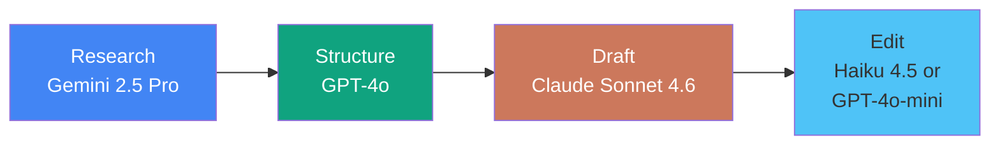

# Chapter 4: Real Project — Multi-Model Content Pipeline

## 20 Minutes to a Professional Deliverable

You've set up your API connections, tested each model, and compared their strengths. Now apply everything to create a real deliverable from your actual work — using the right model for each stage of the process.

## The Multi-Model Approach

The key insight from this morning: no single model is best at everything. Professional AI users route tasks to the model that excels at each stage.



## Choose Your Project Path

Select the path most relevant to your work:

### Path A: Professional Business Document
Perfect for: Executives, consultants, project managers, analysts

### Path B: Academic or Research Output
Perfect for: Researchers, lecturers, PhD students, grant writers

### Path C: Technical Report or Analysis
Perfect for: Engineers, IT professionals, data analysts

### Path D: Content Marketing Package
Perfect for: Marketers, writers, social media managers, freelancers

---

## Path A: Professional Business Document

### Project: Strategic Recommendation Report

You'll create a polished recommendation report using three models in sequence.

### Step 1: Project Setup (2 minutes)

Create this folder structure in VS Code:

```
business-report/
├── research/
│   └── background.md
├── analysis/
│   └── recommendations.md
├── final/
│   └── report.md
└── cost-log.md
```

### Step 2: Research Phase — Gemini 2.5 Flash (3 minutes)

**Why Gemini?** Generous free tier, fast responses, large context for gathering background information.

**File**: `research/background.md`

Start with your topic:
```markdown
# Background Research
Topic: [Your actual business topic — e.g., "Should we adopt AI tools for our sales team?"]
Industry: [Your industry]
Key concerns: [Cost, adoption, training, ROI]
```

**Prompt to Gemini 2.5 Flash** (via Continue or Claude Code with model switch):
```
Based on this topic, provide a structured background briefing covering:
1. Current industry trends (3-4 bullet points)
2. Key statistics and data points
3. Common approaches organisations are taking
4. Risks and considerations
Keep it factual and concise. Cite the type of source for each claim.
```

### Step 3: Analysis Phase — GPT-4o (5 minutes)

**Why GPT-4o?** Strong at logical structure, balanced analysis, and organising complex information.

**File**: `analysis/recommendations.md`

Copy your Gemini research output, then prompt GPT-4o:
```
Using this background research, create a structured analysis with:

1. Executive Summary (3 sentences)
2. Three strategic options with pros, cons, and estimated costs
3. Recommended option with clear justification
4. Implementation timeline (high-level, 3 phases)
5. Risk mitigation strategies (top 3 risks)

Format for a senior leadership audience. Be direct and evidence-based.
```

### Step 4: Drafting Phase — Claude Sonnet 4.6 (8 minutes)

**Why Claude?** Best prose quality, natural writing style, excellent at turning analysis into compelling narrative.

**File**: `final/report.md`

Combine your research and analysis, then prompt Claude Sonnet 4.6:
```
Transform this research and analysis into a polished strategic recommendation report. Include:

- Professional title page with date and author placeholder
- Executive summary (150 words)
- Background section drawing on the research
- Analysis section presenting the three options
- Recommendation with supporting argument
- Implementation roadmap
- Appendix: key data points

Write in a professional but accessible tone suitable for board-level readers.
Use British English throughout.
```

### Step 5: Polish Phase — Haiku 4.5 (2 minutes)

**Why Haiku?** Fast and cheap for editing and proofreading — no need for a premium model.

Prompt:
```
Review this report for:
- Spelling and grammar errors
- Inconsistent formatting
- Unclear sentences
- Missing transitions between sections
List any issues found with suggested corrections.
```

### Deliverable
A board-ready strategic recommendation report created in 20 minutes using four models.

---

## Path B: Academic or Research Output

### Project: Research Summary and Literature Gap Analysis

### Step 1: Project Setup (2 minutes)

```
research-output/
├── sources/
│   └── summaries.md
├── analysis/
│   └── gap-analysis.md
├── final/
│   └── research-brief.md
└── cost-log.md
```

### Step 2: Source Synthesis — Gemini 2.5 Pro (3 minutes)

**Why Gemini 2.5 Pro?** The 2M context window can handle multiple long papers simultaneously.

**File**: `sources/summaries.md`

Start with your research area:
```markdown
# Source Synthesis
Research area: [Your topic — e.g., "AI-assisted diagnostics in NHS primary care"]
Key papers: [List 3-5 authors or titles you know]
Research question: [Your question or hypothesis]
```

**Prompt to Gemini 2.5 Pro:**
```
For this research area, provide:
1. A structured summary of the current state of knowledge (300 words)
2. Key findings from the last 3 years
3. Methodologies commonly used in this field
4. Identified gaps or contradictions in the literature
5. Emerging trends and future directions

Use academic register. Note where claims would need specific citation.
```

### Step 3: Gap Analysis — Claude Sonnet 4.6 (5 minutes)

**Why Claude?** Excellent at nuanced analysis and identifying subtle gaps in reasoning.

**File**: `analysis/gap-analysis.md`

**Prompt:**
```
Based on this literature summary, produce a detailed gap analysis:

1. What questions remain unanswered?
2. Where do methodologies fall short?
3. What populations or contexts are underrepresented?
4. Where do findings contradict each other?
5. What is the single most promising research opportunity?

Write in academic prose suitable for a grant application's "gap in knowledge" section.
British English. Approximately 500 words.
```

### Step 4: Research Brief — Claude Sonnet 4.6 (8 minutes)

**File**: `final/research-brief.md`

**Prompt:**
```
Combine the literature summary and gap analysis into a 2-page research brief containing:

- Title and author placeholder
- Abstract (200 words)
- Background and context
- Current state of knowledge
- Identified gaps
- Proposed research direction
- Expected impact and significance
- Key references placeholder

Format for a funding body audience. Academic but accessible.
```

### Step 5: Proofread — GPT-4o-mini (2 minutes)

**Prompt:**
```
Check this research brief for academic writing quality:
- Consistent tense and voice
- Appropriate hedging language
- Logical flow between sections
- Any unsupported claims
Provide specific corrections.
```

### Deliverable
A research brief suitable as the foundation for a grant application or conference abstract.

---

## Path C: Technical Report or Analysis

### Project: Technology Comparison and Recommendation

### Step 1: Setup (2 minutes)

```
tech-report/
├── research/
│   └── landscape.md
├── comparison/
│   └── matrix.md
├── final/
│   └── recommendation.md
└── cost-log.md
```

### Step 2: Technology Landscape — Gemini 2.5 Flash (3 minutes)

**Prompt:**
```
Provide a structured overview of [your technology area — e.g., "cloud document management platforms for a 200-person organisation"]:

1. Major solutions available (top 5-6)
2. Key differentiators
3. Typical pricing models
4. Integration considerations
5. Security and compliance factors

Be specific and factual. Note where pricing should be verified directly.
```

### Step 3: Comparison Matrix — GPT-4o (5 minutes)

**Prompt:**
```
Using this landscape overview, create:

1. A detailed comparison matrix (markdown table) with these columns:
   Solution | Key Features | Pricing Model | Integration | Security | Score (1-5)
2. Weighted scoring based on: Cost (30%), Features (25%), Security (25%), Integration (20%)
3. Top 3 shortlist with justification

Format for a technical audience who will make the purchasing decision.
```

### Step 4: Recommendation Report — Claude Sonnet 4.6 (8 minutes)

**Prompt:**
```
Write a technology recommendation report containing:

- Executive summary (for non-technical stakeholders)
- Requirements summary
- Evaluation methodology and criteria
- Comparison findings (incorporate the matrix)
- Recommended solution with detailed justification
- Implementation considerations and timeline
- Risk assessment
- Next steps

Professional tone. British English. Include the comparison table.
```

### Step 5: Review — Haiku 4.5 (2 minutes)

**Prompt:**
```
Review for technical accuracy, consistency, and completeness.
Flag any claims that need verification.
Check that the recommendation logically follows from the comparison.
```

### Deliverable
A professional technology recommendation report ready for stakeholder review.

---

## Path D: Content Marketing Package

### Project: Multi-Channel Content from a Single Brief

### Step 1: Setup (2 minutes)

```
content-package/
├── brief/
│   └── core-message.md
├── content/
│   ├── long-form.md
│   ├── social-posts.md
│   └── email-sequence.md
├── final/
│   └── content-calendar.md
└── cost-log.md
```

### Step 2: Core Message Development — Claude Sonnet 4.6 (3 minutes)

**Why Claude first?** Best at understanding brand voice and creating natural, compelling copy.

**File**: `brief/core-message.md`

```markdown
# Content Brief
Product/Service: [Your offering]
Target audience: [Who you're speaking to]
Key message: [The one thing you want them to remember]
Tone: [Professional / Friendly / Authoritative / Playful]
Call to action: [What you want them to do]
```

**Prompt:**
```
Develop this into a complete content brief with:
1. Core message (one sentence)
2. Three supporting messages
3. Key proof points or statistics
4. Audience pain points (top 3)
5. Competitive differentiators
6. Brand voice guidelines for this campaign
```

### Step 3: Long-Form Article — Claude Sonnet 4.6 (5 minutes)

**File**: `content/long-form.md`

**Prompt:**
```
Using this content brief, write a 1,000-word article for our website blog.
Include:
- Engaging headline and subheadline
- Hook in the opening paragraph
- Three main sections with subheadings
- Practical examples or case study references
- Clear call to action at the end
British English. Conversational but professional.
```

### Step 4: Social Media and Email — GPT-4o-mini (8 minutes)

**Why GPT-4o-mini?** Fast, cheap, and perfectly adequate for short-form variations.

**File**: `content/social-posts.md`

**Prompt:**
```
From this article, create:
1. 5 LinkedIn posts (varying lengths: 2 short, 2 medium, 1 long)
2. 5 X/Twitter posts (under 280 characters each)
3. 2 Instagram captions with hashtag suggestions
Each should be self-contained and drive traffic to the full article.
```

**File**: `content/email-sequence.md`

**Prompt:**
```
Create a 3-email nurture sequence based on this content:
Email 1: Awareness (subject line + 150 words)
Email 2: Consideration (subject line + 200 words)
Email 3: Decision (subject line + 150 words with clear CTA)
Include preview text for each.
```

### Step 5: Content Calendar — Haiku 4.5 (2 minutes)

**Prompt:**
```
Create a 2-week content calendar in markdown table format scheduling all the content pieces across channels. Include: Date, Channel, Content Type, Status.
```

### Deliverable
A complete multi-channel content package: article, social posts, email sequence, and publishing calendar.

---

## Cost Tracking (All Paths)

### Log Your Actual Spend

**File**: `cost-log.md`

```markdown
# Project Cost Log

| Step | Model Used | Provider | Est. Tokens | Est. Cost |
|------|-----------|----------|-------------|-----------|
| Research | Gemini 2.5 Flash | Google | ~2,000 | Free tier |
| Analysis | GPT-4o | OpenAI | ~3,000 | ~$0.02 |
| Drafting | Sonnet 4.6 | Anthropic | ~4,000 | ~$0.07 |
| Editing | Haiku 4.5 | Anthropic | ~2,000 | ~$0.01 |
| **Total** | | | **~11,000** | **~$0.10** |

## Comparison
- This project via API: ~$0.10 (approximately 8p)
- Equivalent subscription cost: £57/month for 3 platforms
- Time to complete: 20 minutes
- Time without AI: estimated ___ hours
```

## Universal Project Completion Checklist

Regardless of which path you chose:

- [ ] Used at least 3 different models across the project
- [ ] Matched model strengths to each stage of the workflow
- [ ] Created a complete, professional deliverable
- [ ] Logged actual costs in `cost-log.md`
- [ ] Could explain your model choices to a colleague

## Reflection Questions

After completing your project:

1. **Which model surprised you?** Did any model perform better or worse than expected?
2. **Where did you intervene?** At which stages did you edit the AI output significantly?
3. **What was the total cost?** How does it compare to your current AI subscription spend?
4. **Would you change the model routing?** For this type of project, would you reassign any stage to a different model?
5. **What's your next project?** Identify a real work task you'll tackle this way tomorrow.

## Your Multi-Model Command Centre in Action

You've just demonstrated the core professional AI skill: strategic model routing. Instead of using one expensive model for everything, you chose the right tool for each stage — and produced a better result at a fraction of the cost.

This is the difference between an AI consumer and an AI commander.

## Next Steps

1. **Save your project** as a reusable template for this type of work
2. **Refine your model preferences** based on what you observed
3. **Calculate your monthly savings** if you apply this approach to all AI tasks
4. **Share the cost comparison** with a colleague or manager

---

Next: [Chapter 5: Assessment — Validate Your Skills](./05_assessment.md)

[Back to Exercises](./03_exercises.md) | [Back to Module Overview](README.md)
