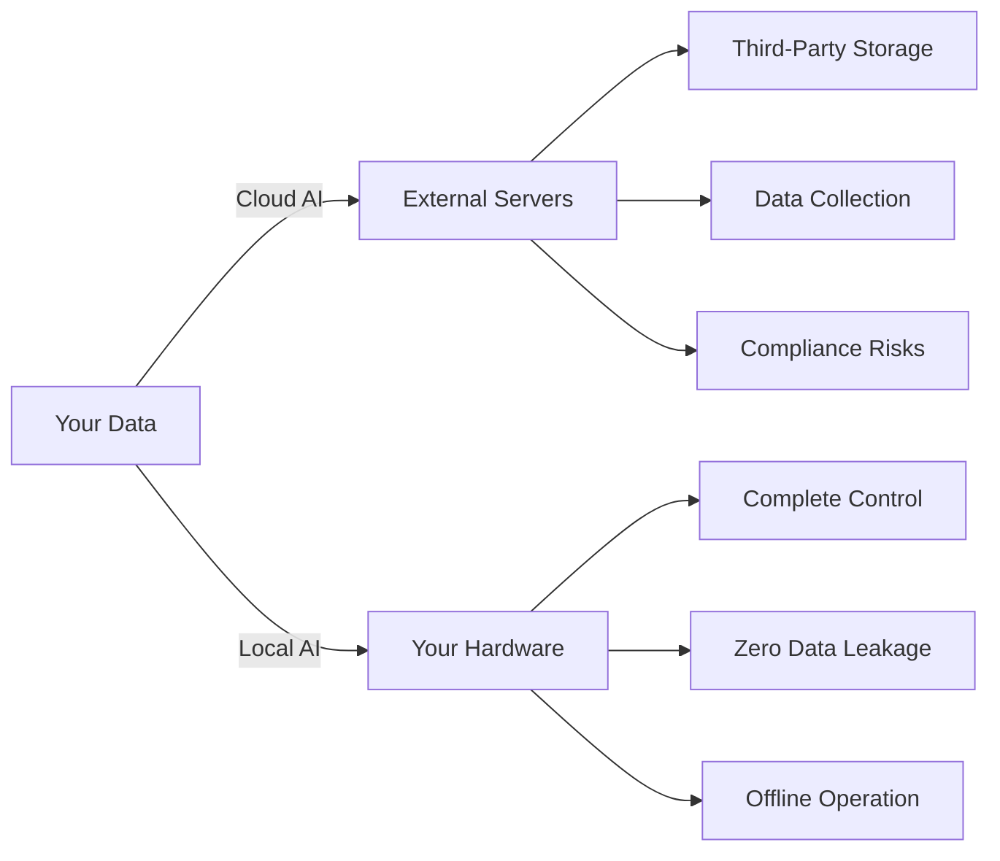
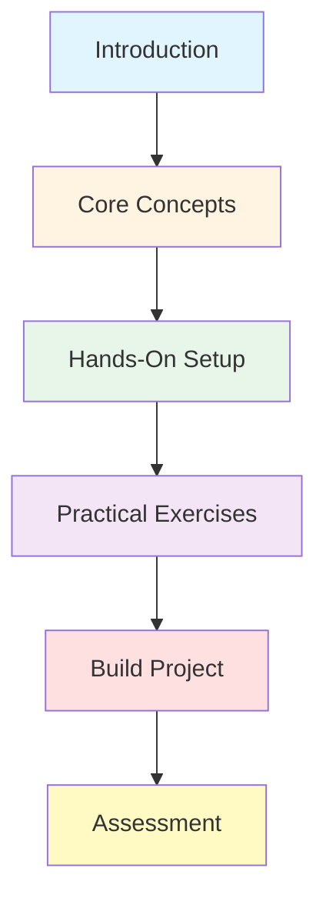

# Introduction to Local AI Models

## Why Run AI Locally?

Running AI models on your own hardware represents a fundamental shift in how we interact with artificial intelligence. Instead of depending on cloud APIs and external services, you gain complete control over your AI infrastructure.

### The Privacy Imperative

When you send data to cloud-based AI services, you're trusting third parties with potentially sensitive information:

- **Medical records** processed through AI diagnostics
- **Financial data** analyzed for insights
- **Proprietary code** sent to AI assistants
- **Personal conversations** stored on external servers

Local AI keeps your data on your machines. No network transmission, no third-party storage, no data collection.



### Cost Economics

Cloud AI services charge per token or request. At scale, costs accumulate rapidly:

| Usage Pattern | Cloud Cost (Monthly) | Local Cost |
|--------------|---------------------|------------|
| Personal assistant (10K tokens/day) | $60-150 | $0* |
| Development team (100K tokens/day) | $600-1,500 | $0* |
| Enterprise (1M tokens/day) | $6,000-15,000 | $0* |

*After initial hardware investment

**Real-World Example:**
A development team using GPT-4 for code reviews might spend $800/month. A one-time investment of $1,500 in a good GPU pays for itself in under 2 months.

### Offline Operation

Local AI works without internet connectivity:

- **Remote locations** without reliable internet
- **Air-gapped environments** for security
- **Disaster scenarios** when cloud services fail
- **Network-restricted regions** with censorship

### Customization and Control

With local models, you have unprecedented flexibility:

- **Fine-tune** models on your specific domain
- **Merge** multiple models for specialized capabilities
- **Quantize** for optimal performance on your hardware
- **Modify** prompts and system instructions without restrictions

## The Technology Landscape

### Model Families

**Llama Family (Meta)**
- Llama 3.1 (8B, 70B, 405B parameters)
- Llama 3.2 (1B, 3B, 11B, 90B)
- Open weights, permissive license
- Best overall performance for open models

**Mistral Family**
- Mistral 7B, Mixtral 8x7B, 8x22B
- Excellent instruction following
- Strong coding capabilities

**Qwen Family (Alibaba)**
- Qwen 2.5 (0.5B to 72B)
- Multilingual excellence
- Strong reasoning abilities

**Phi Family (Microsoft)**
- Phi-3 (3.8B, 7B, 14B)
- Extremely efficient
- Surprising capability for size

### Model Formats Explained

**GGUF (GPT-Generated Unified Format)**
```
llama-3.1-8b-instruct-q4_k_m.gguf
├── llama-3.1-8b-instruct ← Model name and variant
├── q4 ← 4-bit quantization
├── k_m ← K-quant, medium
└── .gguf ← File format
```

Common quantization levels:
- **Q4_K_M**: 4-bit, best balance of size/quality (recommended)
- **Q5_K_M**: 5-bit, higher quality, larger file
- **Q8_0**: 8-bit, near-original quality, much larger

**Performance Impact:**
| Quantization | Size (8B model) | Quality Loss | Speed |
|--------------|-----------------|--------------|-------|
| FP16 (original) | ~16 GB | 0% | Baseline |
| Q8_0 | ~8 GB | ~1% | 1.2x faster |
| Q5_K_M | ~5.5 GB | ~3% | 1.5x faster |
| Q4_K_M | ~4.4 GB | ~5% | 1.8x faster |

### Hardware Requirements

**Minimum (CPU-only):**
- 16 GB RAM
- Modern CPU (Intel i5/AMD Ryzen 5 or better)
- Can run: 3B-7B models at Q4

**Recommended (GPU-accelerated):**
- NVIDIA GPU with 8+ GB VRAM
- 16-32 GB system RAM
- Can run: 7B-13B models at Q4/Q5

**Enthusiast (High-performance):**
- NVIDIA RTX 4090 (24 GB) or A6000 (48 GB)
- 64 GB+ system RAM
- Can run: 70B models at Q4, 30B at Q8

**Apple Silicon Performance:**
```
Model: Llama 3.1 8B Q4_K_M

M1 Pro (16 GB):     ~15 tokens/sec
M2 Max (32 GB):     ~25 tokens/sec
M3 Max (64 GB):     ~35 tokens/sec
M3 Ultra (128 GB):  ~50 tokens/sec
```

Apple's unified memory architecture allows running larger models than NVIDIA GPUs with equivalent VRAM.

## Tools and Platforms

### Ollama (Our Primary Focus)

Ollama is the Docker of AI models - simple, powerful, and developer-friendly.

**Why Ollama?**
- One-line installation on any platform
- Automatic GPU detection and optimization
- Built-in model library with one-command downloads
- REST API for easy integration
- Active development and community

**Quick Start:**
```bash
# Install
curl -fsSL https://ollama.ai/install.sh | sh

# Run a model
ollama run llama3.1:8b

# Use in code
curl http://localhost:11434/api/generate -d '{
  "model": "llama3.1:8b",
  "prompt": "Why is local AI important?"
}'
```

### LM Studio (GUI Alternative)

Best for users who prefer graphical interfaces:
- Beautiful UI for model management
- Built-in model browser and downloader
- Chat interface with conversation history
- Server mode for API access
- Cross-platform (Windows, macOS, Linux)

### llama.cpp (The Engine)

The underlying C++ engine that powers Ollama and LM Studio:
- Extremely optimized for CPU inference
- Support for GPU acceleration (CUDA, Metal, Vulkan)
- Quantization tools
- For advanced users and integration scenarios

### GPT4All (All-in-One)

User-friendly desktop application:
- Pre-configured models
- Privacy-focused (no telemetry)
- Chat interface
- Plugin system

### LocalAI (Self-Hosted Server)

OpenAI API-compatible local server:
- Drop-in replacement for OpenAI API
- Compatible with existing OpenAI client libraries
- Multi-modal support (text, images, audio)
- Docker-based deployment

## What You'll Learn Today

By the end of this morning session, you will:

1. **Understand** the architecture of modern LLMs
2. **Install** and configure Ollama on your system
3. **Run** different models and understand their trade-offs
4. **Integrate** local AI into Python applications
5. **Optimize** performance for your hardware
6. **Build** a practical local AI assistant

## Workshop Structure



**Morning Schedule (3 hours):**
- 9:00-9:30: Introduction and concepts
- 9:30-10:30: Hands-on installation and first models
- 10:30-11:00: Coffee break + model exploration
- 11:00-12:00: Build local AI assistant project

## Pre-Workshop Checklist

Before we begin hands-on work, ensure you have:

- [ ] Computer with 16+ GB RAM
- [ ] 50 GB free disk space (for models)
- [ ] Python 3.8+ installed
- [ ] Basic command line familiarity
- [ ] Text editor or IDE
- [ ] (Optional) NVIDIA GPU with updated drivers

**Hardware Check:**
```bash
# Check RAM
free -h  # Linux
system_profiler SPHardwareDataType | grep Memory  # macOS

# Check disk space
df -h

# Check GPU (NVIDIA)
nvidia-smi

# Check Python
python3 --version
```

## Success Metrics

You'll know you've succeeded when you can:

✅ Explain the benefits of local AI vs cloud APIs
✅ Install and run models using Ollama
✅ Choose appropriate model sizes for your hardware
✅ Integrate local AI into a Python application
✅ Understand quantization and performance trade-offs
✅ Deploy a working AI assistant

## Real-World Applications

Local AI enables unique use cases:

**Healthcare**: Run diagnostic AI on patient data without HIPAA concerns
**Legal**: Analyze contracts and documents with full confidentiality
**Development**: AI code assistant that never sees your proprietary code
**Education**: AI tutors that work offline in rural schools
**Creative**: Generate content without usage restrictions or content filters
**Research**: Reproducible AI experiments with exact model versions

## The Future is Local

The trend toward local AI is accelerating:

- **Model efficiency** improvements (same capability, smaller models)
- **Hardware acceleration** (NPUs in consumer devices)
- **Quantization advances** (better quality at lower bit depths)
- **Edge deployment** (AI on phones, IoT devices)

By mastering local AI today, you're preparing for a future where intelligence is distributed, private, and under your control.

---

## Navigation
- Next: [Core Concepts](01_concepts.md)
- [Back to Module Overview](README.md)

## Quick Links
- [Ollama Installation Guide](02_hands_on.md#installing-ollama)
- [Model Selection Guide](01_concepts.md#choosing-models)
- [Project: Build AI Assistant](04_project.md)
