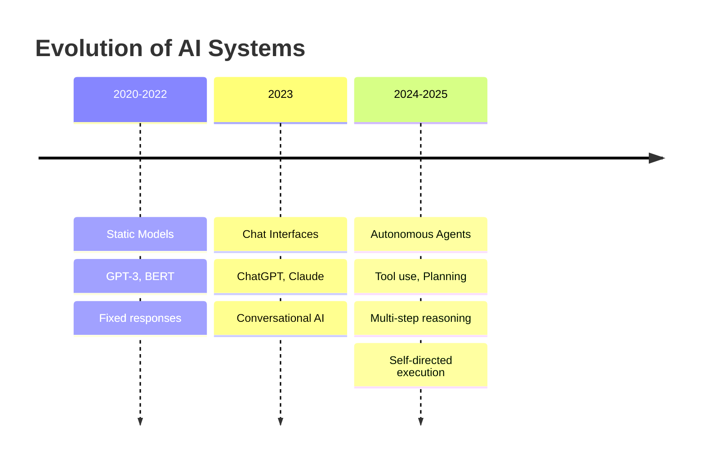
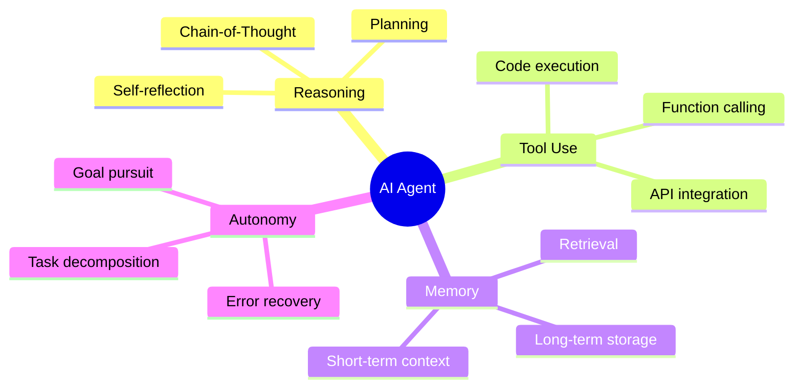
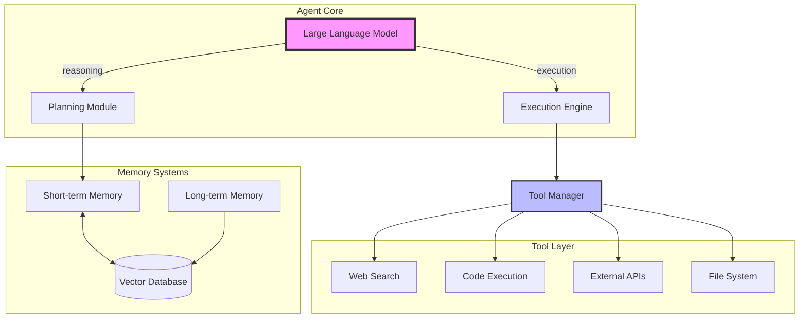
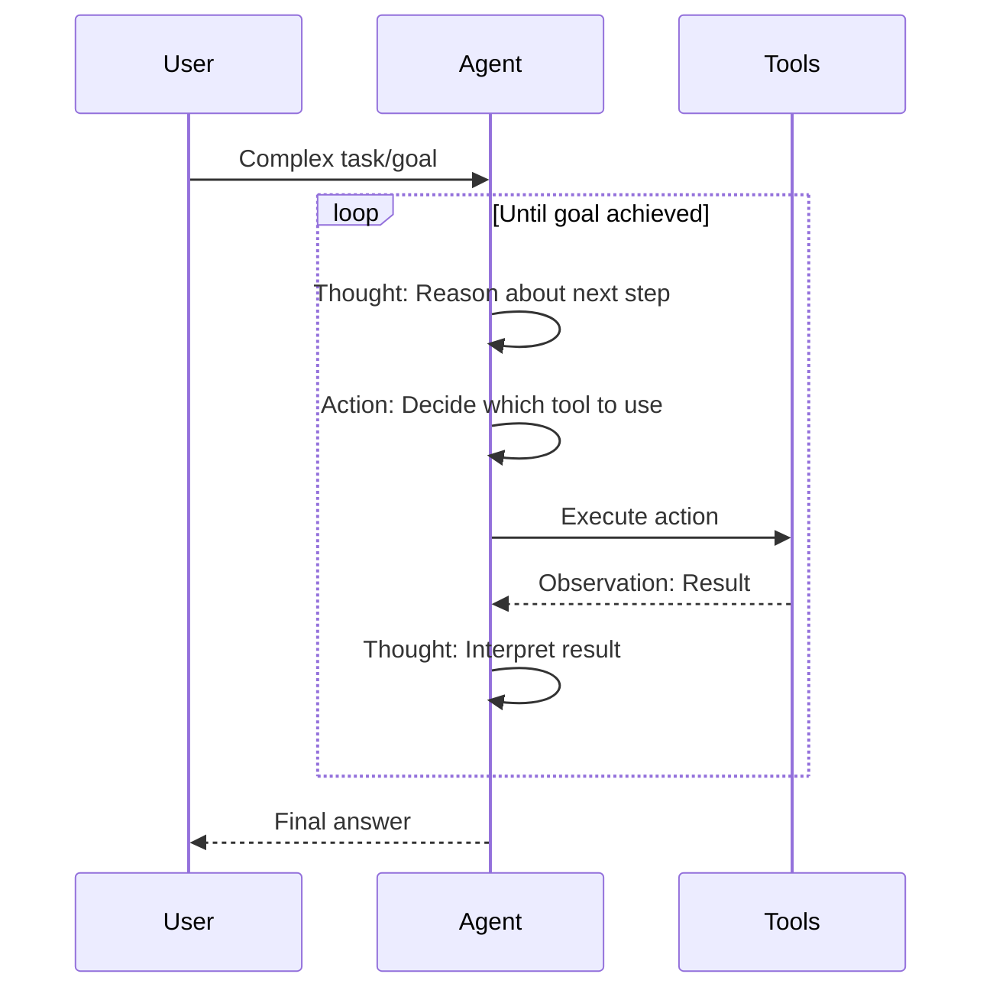
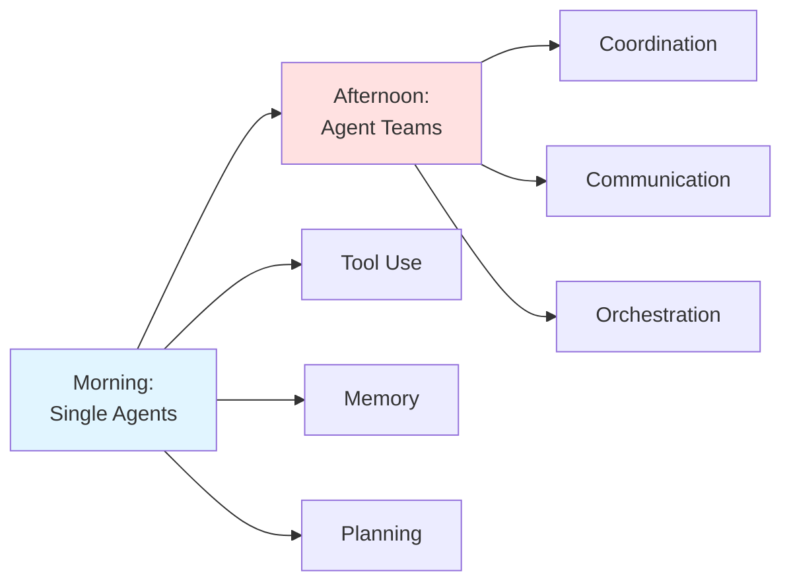

# Introduction to AI Agents

## The Age of Autonomous AI (2024-2025)

We're witnessing a fundamental shift in how AI systems operate. Rather than simple question-answer interactions, modern AI agents can **reason, plan, use tools, and execute complex tasks autonomously**.

### What Makes 2024-2025 Different?



### The Agent Revolution

**Traditional AI (Pre-2024)**:
- User asks question → AI responds
- No tool access
- No memory between sessions
- No ability to break down complex tasks

**AI Agents (2024-2025)**:
- AI receives goal → Plans steps → Executes autonomously
- Can use external tools (search, APIs, code execution)
- Maintains conversation and task memory
- Decomposes complex problems into subtasks
- Self-corrects when errors occur

### Real-World Agent Applications

| Domain | Agent Type | Capabilities |
|--------|-----------|--------------|
| **Software Development** | Code Agent | Writes code, runs tests, debugs, deploys |
| **Research** | Research Agent | Searches web, reads papers, synthesizes findings |
| **Data Analysis** | Analytics Agent | Queries databases, creates visualizations, reports insights |
| **Customer Service** | Support Agent | Accesses knowledge base, resolves issues, escalates when needed |
| **DevOps** | Operations Agent | Monitors systems, diagnoses issues, applies fixes |

### Key Agent Capabilities



## The Agent Architecture Stack

Modern AI agents combine multiple components:



## Why Agents Matter Now

### 1. Foundation Models Are Ready

Models like GPT-4, Claude 3.5, and Gemini 1.5 have:
- Strong reasoning capabilities
- Reliable tool use
- Extended context windows (200K+ tokens)
- Reduced hallucination rates

### 2. Tooling Infrastructure Exists

The ecosystem has matured:
- **LangChain**: Agent frameworks and tools
- **Claude API**: Native tool use support
- **OpenAI Function Calling**: Structured tool integration
- **Vector Databases**: Efficient memory systems

### 3. Production Use Cases Are Proven

Companies are deploying agents at scale:
- **GitHub Copilot Workspace**: Autonomous coding agent
- **Devin**: AI software engineer
- **AutoGPT**: General-purpose autonomous agent
- **Claude Code**: Development environment agent

## The ReAct Pattern: Reasoning + Acting

The breakthrough that made modern agents possible:



**Example: "Find the latest AI research on agents and summarize"**

```
Thought: I need to search for recent AI agent research papers
Action: search("AI agents research 2024")
Observation: Found 5 recent papers from arXiv

Thought: I should read the abstracts of these papers
Action: read_url("https://arxiv.org/abs/2401.xxxxx")
Observation: Paper discusses multi-agent coordination...

Thought: Now I can synthesize findings
Action: create_summary([paper1, paper2, paper3])
Observation: Summary created

Thought: I have enough information to answer
Final Answer: Recent AI agent research focuses on...
```

## What You'll Build Today

By the end of this workshop, you'll create:

1. **Basic Agent**: Simple tool-using agent with Claude API
2. **Research Agent**: Web-searching autonomous agent
3. **Code Agent**: Agent that writes and executes Python code
4. **Multi-Tool Agent**: Agent combining multiple capabilities

### Technologies Covered

- **Claude API**: Anthropic's tool use implementation
- **OpenAI Functions**: Function calling with GPT-4
- **LangChain Agents**: Framework for agent development
- **Python Tools**: Building custom agent capabilities

## The Agent Mindset

Building agents requires thinking differently:

| Traditional Programming | Agent Programming |
|------------------------|-------------------|
| Explicit control flow | Goal-directed behavior |
| Deterministic execution | Probabilistic reasoning |
| Error handling with try/catch | Self-correction loops |
| Fixed functionality | Dynamic tool selection |
| Step-by-step instructions | High-level objectives |

## Looking Ahead

This morning focuses on **individual agents**. This afternoon, we'll explore:
- Multi-agent systems
- Agent orchestration patterns
- Swarm intelligence
- Specialized agent teams



## Navigation
- Next: [Core Concepts](01_concepts.md)
- [Back to Module Overview](README.md)
