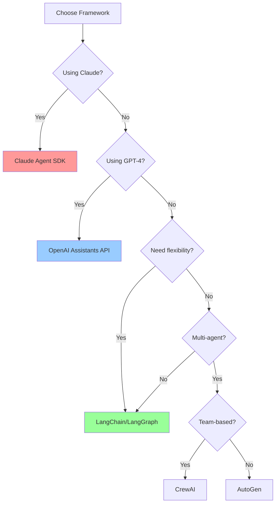

# Core Agent Concepts (2025)

> **Duration**: 45 minutes
> **Difficulty**: ⭐⭐ Intermediate
> **Prerequisites**: LLM API experience, Python basics

## Agent Frameworks Landscape (2025)

The AI agent ecosystem has matured significantly. Here's your framework decision tree:



### 1. Claude Agent SDK (Anthropic Official)

**Best for**: Production Claude applications with type safety

**Strengths**:
- ✅ Official Anthropic support
- ✅ Built-in error handling and retries
- ✅ Native MCP server integration
- ✅ Type-safe tool definitions
- ✅ Excellent documentation

**Example**: Basic tool use

```python
import anthropic
import os

client = anthropic.Anthropic(api_key=os.environ["ANTHROPIC_API_KEY"])

tools = [
    {
        "name": "get_weather",
        "description": "Get current weather for a location",
        "input_schema": {
            "type": "object",
            "properties": {
                "location": {
                    "type": "string",
                    "description": "City and country, e.g. 'London, UK'"
                },
                "unit": {
                    "type": "string",
                    "enum": ["celsius", "fahrenheit"],
                    "description": "Temperature unit"
                }
            },
            "required": ["location"]
        }
    }
]

def process_tool_call(tool_name, tool_input):
    if tool_name == "get_weather":
        # Call weather API
        return f"Weather in {tool_input['location']}: 18°C, Sunny"

# Agent loop
messages = [{"role": "user", "content": "What's the weather in Paris?"}]

while True:
    response = client.messages.create(
        model="claude-3-5-sonnet-20241022",
        max_tokens=1024,
        tools=tools,
        messages=messages
    )

    # Add assistant response
    messages.append({"role": "assistant", "content": response.content})

    if response.stop_reason == "end_turn":
        # Extract final answer
        text = next((b.text for b in response.content if hasattr(b, "text")), "")
        print(f"Answer: {text}")
        break

    if response.stop_reason == "tool_use":
        # Process tool calls
        tool_results = []
        for block in response.content:
            if block.type == "tool_use":
                result = process_tool_call(block.name, block.input)
                tool_results.append({
                    "type": "tool_result",
                    "tool_use_id": block.id,
                    "content": result
                })

        # Add tool results
        messages.append({"role": "user", "content": tool_results})
```

**When to use**: Building serious Claude applications, need reliability, want official support

### 2. OpenAI Assistants API

**Best for**: Rapid prototyping with GPT-4, managed infrastructure

**Strengths**:
- ✅ Fully managed (no server code needed)
- ✅ Built-in code interpreter
- ✅ File search and retrieval
- ✅ Persistent threads
- ✅ Function calling

**Example**: Assistant with code interpreter

```python
from openai import OpenAI

client = OpenAI()

# Create assistant (one-time setup)
assistant = client.beta.assistants.create(
    name="Data Analyst",
    instructions="You analyze data and create visualizations using Python",
    tools=[{"type": "code_interpreter"}],
    model="gpt-4-turbo-preview"
)

# Create conversation thread
thread = client.beta.threads.create()

# Add message
message = client.beta.threads.messages.create(
    thread_id=thread.id,
    role="user",
    content="Analyze this data: [1, 5, 3, 9, 2] and create a bar chart"
)

# Run assistant
run = client.beta.threads.runs.create_and_poll(
    thread_id=thread.id,
    assistant_id=assistant.id
)

if run.status == 'completed':
    # Get messages
    messages = client.beta.threads.messages.list(thread_id=thread.id)
    for msg in messages.data:
        print(f"{msg.role}: {msg.content[0].text.value}")
```

**When to use**: Need quick prototype, want managed infrastructure, GPT-4 preference

### 3. LangChain & LangGraph

**Best for**: Complex workflows, framework-agnostic, advanced orchestration

**Strengths**:
- ✅ Works with any LLM
- ✅ Massive tool ecosystem
- ✅ Advanced agent types (ReAct, Plan-and-Execute)
- ✅ LangGraph for state machines
- ✅ Strong community

**Example**: ReAct agent with multiple tools

```python
from langchain.agents import create_react_agent, AgentExecutor
from langchain_anthropic import ChatAnthropic
from langchain_community.tools.tavily_search import TavilySearchResults
from langchain import hub

# Initialize LLM
llm = ChatAnthropic(model="claude-3-5-sonnet-20241022")

# Create tools
search = TavilySearchResults(max_results=3)

from langchain.tools import Tool

def calculator(expression: str) -> str:
    """Evaluate math expression"""
    try:
        return str(eval(expression, {"__builtins__": {}}, {}))
    except Exception as e:
        return f"Error: {str(e)}"

tools = [
    search,
    Tool(
        name="Calculator",
        func=calculator,
        description="Perform mathematical calculations. Input: valid Python expression."
    )
]

# Get ReAct prompt
prompt = hub.pull("hwchase17/react")

# Create agent
agent = create_react_agent(llm, tools, prompt)

# Create executor
agent_executor = AgentExecutor(
    agent=agent,
    tools=tools,
    verbose=True,
    max_iterations=5
)

# Run
result = agent_executor.invoke({
    "input": "What's the population of Tokyo and what's 15% of that number?"
})

print(result["output"])
```

**When to use**: Need flexibility, complex workflows, multi-model support

### 4. AutoGen (Microsoft)

**Best for**: Multi-agent conversations, code generation

**Strengths**:
- ✅ Agent-to-agent communication
- ✅ Built-in code execution
- ✅ Group chat patterns
- ✅ Human-in-the-loop
- ✅ Great for coding tasks

**Example**: Two agents collaborating

```python
import autogen

config_list = [{
    "model": "gpt-4",
    "api_key": os.environ["OPENAI_API_KEY"]
}]

# Create assistant agent
assistant = autogen.AssistantAgent(
    name="assistant",
    llm_config={"config_list": config_list}
)

# Create user proxy (executes code)
user_proxy = autogen.UserProxyAgent(
    name="user_proxy",
    human_input_mode="NEVER",
    max_consecutive_auto_reply=10,
    code_execution_config={"work_dir": "coding"},
)

# Start conversation
user_proxy.initiate_chat(
    assistant,
    message="Write Python code to calculate the 10th Fibonacci number and execute it"
)
```

**When to use**: Multi-agent scenarios, code generation, collaborative problem-solving

### 5. CrewAI

**Best for**: Role-based agent teams, content creation

**Strengths**:
- ✅ Simple API
- ✅ Role-based abstraction
- ✅ Built-in collaboration patterns
- ✅ Good documentation
- ✅ Rapid development

**Example**: Research and writing crew

```python
from crewai import Agent, Task, Crew

# Define agents
researcher = Agent(
    role="Research Analyst",
    goal="Find accurate information on topics",
    backstory="Expert researcher with attention to detail",
    tools=[search_tool],
    verbose=True
)

writer = Agent(
    role="Content Writer",
    goal="Write engaging content based on research",
    backstory="Experienced writer with clear communication style",
    verbose=True
)

# Define tasks
research_task = Task(
    description="Research the latest AI agent frameworks in 2025",
    agent=researcher,
    expected_output="Detailed research notes with sources"
)

writing_task = Task(
    description="Write a blog post about AI agent frameworks based on research",
    agent=writer,
    expected_output="800-word blog post in markdown"
)

# Create crew
crew = Crew(
    agents=[researcher, writer],
    tasks=[research_task, writing_task],
    verbose=True
)

# Execute
result = crew.kickoff()
print(result)
```

**When to use**: Content creation, team-based workflows, rapid prototyping

## Tool Use: The Agent's Hands

### Modern Tool Calling (2025)

All major LLMs now support structured tool calling. Here's the pattern:

```python
# 1. Define tool schema
tool_schema = {
    "name": "search_database",
    "description": "Search product database",
    "input_schema": {
        "type": "object",
        "properties": {
            "query": {"type": "string"},
            "filters": {
                "type": "object",
                "properties": {
                    "category": {"type": "string"},
                    "min_price": {"type": "number"},
                    "max_price": {"type": "number"}
                }
            }
        },
        "required": ["query"]
    }
}

# 2. Implement tool function
def search_database(query: str, filters: dict = None):
    # Your implementation
    results = db.search(query, **filters)
    return {"results": results, "count": len(results)}

# 3. LLM chooses tool automatically
# (framework handles routing)

# 4. Execute and return results
```

### MCP (Model Context Protocol)

MCP standardizes tool integration across frameworks:

```typescript
// MCP Server Example (filesystem)
{
  "tools": [
    {
      "name": "read_file",
      "description": "Read file contents",
      "inputSchema": {
        "type": "object",
        "properties": {
          "path": {"type": "string"}
        }
      }
    }
  ]
}
```

**Popular MCP Servers** (2025):
- **@modelcontextprotocol/server-filesystem** - File operations
- **@modelcontextprotocol/server-github** - GitHub integration
- **@modelcontextprotocol/server-postgres** - Database queries
- **@modelcontextprotocol/server-brave-search** - Web search
- **@modelcontextprotocol/server-slack** - Slack integration

### Code Execution Sandboxes

For safe code execution:

**E2B Sandboxes**:
```python
from e2b import Sandbox

sandbox = Sandbox(template="base")

# Execute code safely
result = sandbox.process.start_and_wait(
    cmd="python -c 'print(sum([1, 2, 3, 4, 5]))'"
)

print(result.stdout)  # "15"
sandbox.close()
```

**Modal Functions**:
```python
import modal

app = modal.App("agent-sandbox")

@app.function()
def execute_code(code: str):
    # Runs in isolated container
    exec(code)

# Call from agent
result = execute_code.remote("print('Hello from sandbox')")
```

## Agent Architectures

### 1. ReAct (Reasoning + Acting)

Most common pattern for general-purpose agents:

```
Loop until goal achieved:
  1. THOUGHT: Reason about current state and next action
  2. ACTION: Choose and execute a tool
  3. OBSERVATION: Process tool result
  4. [Repeat or conclude]
```

**Strengths**: Simple, interpretable, works well for most tasks
**Weaknesses**: Can waste API calls, no look-ahead planning

### 2. Plan-and-Execute

Create complete plan first, then execute:

```
1. PLANNING PHASE:
   - Analyze goal
   - Break into subtasks
   - Order by dependencies

2. EXECUTION PHASE:
   - Execute each subtask
   - Adapt plan if failures
   - Synthesize results
```

**Strengths**: More efficient, better for complex tasks, parallelizable
**Weaknesses**: Harder to implement, less flexible to changes

### 3. Reflection

Agent evaluates its own work:

```
1. GENERATE: Produce initial solution
2. CRITIQUE: Identify issues
3. REFINE: Improve based on critique
4. [Repeat 2-3 until quality threshold]
```

**Strengths**: Higher quality outputs, learns from mistakes
**Weaknesses**: More expensive (extra LLM calls), slower

### 4. Tree of Thoughts

Explore multiple reasoning paths:

```
1. Generate multiple approaches
2. Evaluate each approach
3. Expand most promising paths
4. Backtrack if dead end
5. Select best solution
```

**Strengths**: Best for complex reasoning, finds optimal solutions
**Weaknesses**: Very expensive, slow, overkill for simple tasks

## Memory Systems

### Short-term Memory (Conversation Buffer)

```python
class ConversationMemory:
    def __init__(self, max_messages=10):
        self.messages = []
        self.max_messages = max_messages

    def add(self, role, content):
        self.messages.append({"role": role, "content": content})
        if len(self.messages) > self.max_messages:
            self.messages.pop(0)  # Remove oldest

    def get_context(self):
        return self.messages
```

### Long-term Memory (Vector Store)

```python
from langchain_community.vectorstores import Chroma
from langchain_openai import OpenAIEmbeddings

class AgentMemory:
    def __init__(self):
        self.embeddings = OpenAIEmbeddings()
        self.vectorstore = Chroma(
            embedding_function=self.embeddings,
            persist_directory="./memory"
        )

    def remember(self, content, metadata=None):
        """Store in long-term memory"""
        self.vectorstore.add_texts(
            texts=[content],
            metadatas=[metadata or {}]
        )

    def recall(self, query, k=5):
        """Retrieve relevant memories"""
        docs = self.vectorstore.similarity_search(query, k=k)
        return [doc.page_content for doc in docs]
```

### Working Memory (Task State)

```python
class WorkingMemory:
    def __init__(self):
        self.current_goal = None
        self.plan = []
        self.completed_steps = []
        self.tool_results = {}

    def set_goal(self, goal):
        self.current_goal = goal

    def add_step_result(self, step, result):
        self.completed_steps.append(step)
        self.tool_results[step] = result

    def get_context(self):
        return {
            "goal": self.current_goal,
            "progress": f"{len(self.completed_steps)}/{len(self.plan)} steps",
            "recent_results": self.tool_results
        }
```

## Error Handling & Robustness

### Retry Logic with Exponential Backoff

```python
from tenacity import retry, stop_after_attempt, wait_exponential

@retry(
    stop=stop_after_attempt(3),
    wait=wait_exponential(multiplier=1, min=4, max=10)
)
def call_tool_with_retry(tool_name, params):
    """Retry tool calls on failure"""
    try:
        return execute_tool(tool_name, params)
    except Exception as e:
        print(f"Tool call failed: {e}, retrying...")
        raise  # Tenacity will retry
```

### Validation and Self-Correction

```python
def execute_with_validation(agent, task):
    """Execute task with result validation"""
    max_retries = 3

    for attempt in range(max_retries):
        result = agent.run(task)

        # Validate result
        validation = agent.validate_result(result, task)

        if validation["is_valid"]:
            return result

        # Ask agent to correct
        correction_prompt = f"""
        Your previous result had issues:
        {validation['issues']}

        Please correct and try again.
        Previous attempt: {result}
        """

        task = correction_prompt

    raise Exception("Failed to produce valid result")
```

## Production Best Practices

### 1. Cost Control

```python
class CostController:
    def __init__(self, max_tokens=10000):
        self.tokens_used = 0
        self.max_tokens = max_tokens

    def check_budget(self, estimated_tokens):
        if self.tokens_used + estimated_tokens > self.max_tokens:
            raise Exception("Token budget exceeded")

    def track_usage(self, response):
        self.tokens_used += response.usage.total_tokens
        print(f"Tokens: {self.tokens_used}/{self.max_tokens}")
```

### 2. Timeout Protection

```python
import signal

class TimeoutError(Exception):
    pass

def timeout_handler(signum, frame):
    raise TimeoutError("Agent execution timeout")

def run_with_timeout(agent, task, timeout_seconds=60):
    signal.signal(signal.SIGALRM, timeout_handler)
    signal.alarm(timeout_seconds)

    try:
        result = agent.run(task)
        signal.alarm(0)  # Cancel alarm
        return result
    except TimeoutError:
        print("Agent took too long, stopping...")
        return None
```

### 3. Monitoring and Logging

```python
import logging
from datetime import datetime

class AgentMonitor:
    def __init__(self):
        self.logger = logging.getLogger("agent")
        self.metrics = {
            "tool_calls": [],
            "errors": [],
            "token_usage": []
        }

    def log_tool_call(self, tool_name, params, result):
        entry = {
            "timestamp": datetime.now().isoformat(),
            "tool": tool_name,
            "params": params,
            "success": result is not None
        }
        self.metrics["tool_calls"].append(entry)
        self.logger.info(f"Tool: {tool_name}, Success: {entry['success']}")

    def generate_report(self):
        return {
            "total_tools": len(self.metrics["tool_calls"]),
            "success_rate": self._calculate_success_rate(),
            "most_used_tool": self._get_most_used_tool()
        }
```

## Next Steps

**Continue to**: [Hands-On Practice](02_hands_on.md) - Build your first agents

**Key Takeaways**:
- Choose framework based on your needs (Claude SDK, OpenAI Assistants, LangChain, AutoGen, CrewAI)
- All modern LLMs support structured tool calling
- ReAct is the most common agent pattern
- Memory systems combine short-term, working, and long-term storage
- Production agents need cost control, timeouts, and monitoring

## Navigation
- Previous: [Introduction](00_introduction.md)
- Next: [Hands-on Development](02_hands_on.md)
- [Back to Module Overview](README.md)
