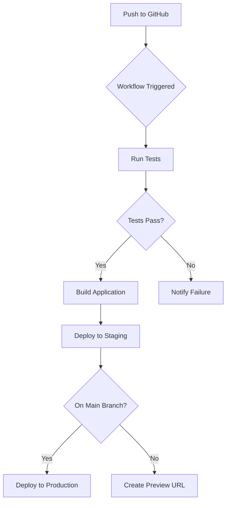
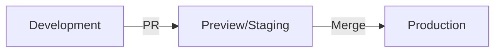

# Core Concepts: Modern Deployment & Publishing

> **Section Duration:** 60 minutes
> **Difficulty:** 🟡 Intermediate

## Understanding the Deployment Landscape (2025)

The deployment ecosystem has evolved dramatically. Let's understand the core concepts that power modern application delivery.

---

## 1. Deployment Platform Types

### Frontend-First Platforms

Perfect for React, Vue, and Next.js applications with automatic optimizations.

#### **Vercel** (Recommended for React/Next.js)

```yaml
Key Features:
  - Zero-config deployments
  - Automatic HTTPS & CDN
  - Edge functions at 300+ locations
  - Preview deployments per PR
  - Web Analytics built-in

Best For:
  - Next.js applications (built by Vercel)
  - React SPAs with API routes
  - Static sites with dynamic capabilities

Pricing:
  - Free: Hobby projects, unlimited deployments
  - Pro: $20/month per user, team features
```

**Example Deployment Flow:**

```bash
# Install Vercel CLI
npm i -g vercel

# Deploy from any directory
vercel

# Production deployment
vercel --prod
```

#### **Netlify** (Best for JAMstack)

```yaml
Key Features:
  - Instant rollbacks
  - Split testing (A/B)
  - Form handling without backend
  - Serverless functions
  - Build plugins ecosystem

Best For:
  - Static site generators (Hugo, Jekyll)
  - JAMstack architectures
  - Sites with form submissions

Pricing:
  - Free: 100GB bandwidth/month
  - Pro: $19/month, 1TB bandwidth
```

#### **Cloudflare Pages** (Edge-First)

```yaml
Key Features:
  - Global edge network (275+ cities)
  - Unlimited bandwidth (Free tier)
  - Workers for edge computing
  - R2 object storage integration

Best For:
  - High-traffic static sites
  - Edge-computed applications
  - Cost-sensitive projects

Pricing:
  - Free: Unlimited requests & bandwidth
  - Workers Paid: $5/month for advanced features
```

---

### Backend & Fullstack Platforms

For APIs, databases, and complete applications.

#### **Railway** (Modern PaaS)

```yaml
Key Features:
  - One-click database provisioning
  - Auto-scaling based on load
  - GitHub integration
  - Environment variables UI
  - Cron jobs support

Best For:
  - Node.js APIs
  - Python backends (FastAPI, Django)
  - Full-stack applications
  - Scheduled tasks

Pricing:
  - Free: $5 trial credit
  - Pay-as-you-go: Based on usage
```

**Railway Deployment Example:**

```bash
# Install Railway CLI
npm i -g @railway/cli

# Login and initialize
railway login
railway init

# Deploy
railway up
```

#### **Render** (All-in-One)

```yaml
Key Features:
  - Free PostgreSQL databases
  - Auto-deploy from Git
  - Private services (no public access)
  - Background workers
  - Redis support

Best For:
  - Production APIs
  - Services needing databases
  - Background job processing

Pricing:
  - Free: Static sites, limited services
  - Starter: $7/month per service
```

---

## 2. Continuous Integration/Deployment (CI/CD)

### GitHub Actions Architecture

GitHub Actions is the modern standard for CI/CD, integrated directly into your repositories.



### Core GitHub Actions Concepts

#### **Workflows**

YAML files in `.github/workflows/` that define automation.

```yaml
# .github/workflows/deploy.yml
name: Deploy to Production

on:
  push:
    branches: [main]
  pull_request:
    branches: [main]

jobs:
  deploy:
    runs-on: ubuntu-latest
    steps:
      - uses: actions/checkout@v4
      - uses: actions/setup-node@v4
        with:
          node-version: '20'
      - run: npm ci
      - run: npm test
      - run: npm run build
```

#### **Events** (Workflow Triggers)

```yaml
# Common triggers
on:
  push:                    # Any push
    branches: [main]       # Only main branch
  pull_request:            # PRs opened/updated
  schedule:                # Cron jobs
    - cron: '0 0 * * *'   # Daily at midnight
  workflow_dispatch:       # Manual trigger
  release:                 # New releases
    types: [published]
```

#### **Jobs & Steps**

```yaml
jobs:
  test:
    runs-on: ubuntu-latest
    steps:
      - name: Checkout code
        uses: actions/checkout@v4

      - name: Run tests
        run: npm test

  deploy:
    needs: test              # Run after test job
    runs-on: ubuntu-latest
    steps:
      - name: Deploy to Vercel
        run: vercel --prod --token=${{ secrets.VERCEL_TOKEN }}
```

---

## 3. Environment Management

### The Three-Environment Strategy



#### **Development**

- **Location**: Your local machine
- **Purpose**: Rapid iteration and debugging
- **Database**: Local SQLite or Docker containers
- **API Keys**: Development/sandbox keys

#### **Preview/Staging**

- **Location**: Auto-deployed from PRs
- **Purpose**: Test changes before production
- **Database**: Staging database (copy of prod structure)
- **API Keys**: Test mode keys
- **URL**: Unique per PR (e.g., `pr-123.vercel.app`)

#### **Production**

- **Location**: Main branch deployment
- **Purpose**: Live application for users
- **Database**: Production database with backups
- **API Keys**: Live mode keys
- **URL**: Your custom domain

### Managing Environment Variables

Never commit secrets to Git. Use platform-specific variable management.

#### **Vercel Environment Variables**

```bash
# Via CLI
vercel env add DATABASE_URL production

# Via Dashboard
# Project Settings > Environment Variables
# Separate values for Production, Preview, Development
```

#### **Railway Environment Variables**

```bash
# Via CLI
railway variables set DATABASE_URL="postgresql://..."

# Via Dashboard
# Service > Variables tab
# Variables are encrypted at rest
```

#### **GitHub Actions Secrets**

```yaml
# .github/workflows/deploy.yml
jobs:
  deploy:
    steps:
      - name: Deploy
        env:
          API_KEY: ${{ secrets.API_KEY }}
          DATABASE_URL: ${{ secrets.DATABASE_URL }}
        run: npm run deploy
```

Add secrets: Repository Settings > Secrets and variables > Actions

---

## 4. Documentation Publishing Strategies

### Component Documentation (Storybook)

Visual documentation for UI components with interactive examples.

```javascript
// Button.stories.js
import Button from './Button';

export default {
  title: 'Components/Button',
  component: Button,
  parameters: {
    docs: {
      description: {
        component: 'A versatile button component with multiple variants.'
      }
    }
  }
};

export const Primary = {
  args: {
    variant: 'primary',
    children: 'Click me'
  }
};

export const Secondary = {
  args: {
    variant: 'secondary',
    children: 'Click me'
  }
};
```

**Deployment Options:**
- **Chromatic**: Automated visual testing + hosting
- **Netlify/Vercel**: Static Storybook build
- **GitHub Pages**: Free hosting for docs

---

### API Documentation (OpenAPI/Swagger)

Interactive API documentation with try-it-out capabilities.

```yaml
# openapi.yaml
openapi: 3.0.0
info:
  title: Task Manager API
  version: 1.0.0
  description: REST API for task management

paths:
  /api/tasks:
    get:
      summary: List all tasks
      responses:
        '200':
          description: Successful response
          content:
            application/json:
              schema:
                type: array
                items:
                  $ref: '#/components/schemas/Task'

components:
  schemas:
    Task:
      type: object
      properties:
        id:
          type: string
        title:
          type: string
        completed:
          type: boolean
```

**Tools:**
- **Swagger UI**: Interactive API explorer
- **Redoc**: Beautiful API documentation
- **Stoplight**: API design and docs platform

---

### User Documentation (MkDocs Material)

Comprehensive guides, tutorials, and references.

```yaml
# mkdocs.yml
site_name: My Application Docs
theme:
  name: material
  features:
    - navigation.tabs
    - navigation.sections
    - search.suggest
    - content.code.copy
  palette:
    scheme: slate
    primary: indigo

plugins:
  - search
  - awesome-pages

markdown_extensions:
  - pymdownx.highlight:
      anchor_linenums: true
  - pymdownx.superfences:
      custom_fences:
        - name: mermaid
          class: mermaid
```

**Deployment:**

```bash
# Build and deploy to GitHub Pages
mkdocs gh-deploy

# Or deploy to Vercel/Netlify
mkdocs build
vercel deploy
```

---

## 5. Deployment Best Practices (2025)

### ✅ Always Do

1. **Use Preview Deployments**: Test every PR before merging
2. **Automate Testing**: Run tests in CI before deployment
3. **Environment Parity**: Keep staging similar to production
4. **Monitor Deployments**: Set up error tracking (Sentry, LogRocket)
5. **Version Your APIs**: Use `/v1/`, `/v2/` in API paths
6. **Enable Rollbacks**: Keep previous deployments accessible

### ❌ Never Do

1. **Commit Secrets**: Use environment variables instead
2. **Skip Testing**: Always run tests before production
3. **Manual Deployments**: Automate with CI/CD
4. **Ignore Build Warnings**: They often indicate future problems
5. **Deploy on Fridays**: Leave time to fix issues before weekends
6. **Use Default Secrets**: Rotate and customize all keys

---

## 6. Deployment Checklist

Before deploying to production:

```markdown
### Pre-Deployment
- [ ] All tests passing locally
- [ ] Environment variables configured
- [ ] Database migrations tested
- [ ] Build completes without errors
- [ ] Static assets optimized
- [ ] API rate limits configured

### Post-Deployment
- [ ] Health check endpoint responding
- [ ] Critical user flows tested
- [ ] Error tracking configured
- [ ] Analytics/monitoring active
- [ ] DNS configured correctly
- [ ] HTTPS certificate valid
- [ ] Performance metrics acceptable
```

---

## Platform Comparison Matrix

Choose the right platform for your project:

| Feature | Vercel | Netlify | Cloudflare Pages | Railway | Render |
|---------|--------|---------|------------------|---------|--------|
| **Best For** | Next.js | JAMstack | Edge apps | APIs | Full-stack |
| **Free Tier** | ✅ Generous | ✅ Good | ✅ Unlimited | ⚠️ Trial | ⚠️ Limited |
| **Build Minutes** | Unlimited | 300/mo | 500/mo | Unlimited | 400/mo |
| **Bandwidth** | 100GB | 100GB | Unlimited | 100GB | 100GB |
| **Edge Locations** | 300+ | Limited | 275+ | N/A | N/A |
| **Database** | ❌ | ❌ | ❌ | ✅ | ✅ |
| **Serverless** | ✅ | ✅ | ✅ Workers | ✅ | ✅ |
| **Preview Deploys** | ✅ | ✅ | ✅ | ✅ | ✅ |
| **Custom Domains** | ✅ Free | ✅ Free | ✅ Free | ✅ Free | ✅ Free |

---

## Key Takeaways

1. **Choose the Right Platform**: Match platform strengths to your project needs
2. **Automate Everything**: Use CI/CD for consistent, reliable deployments
3. **Environment Separation**: Development → Preview → Production
4. **Documentation Matters**: Good docs reduce support burden
5. **Monitor Continuously**: Know when things break before users complain

---

**Next:** [02_hands_on.md](02_hands_on.md) - Deploying Your First Application

---

## Additional Resources

- [Vercel Documentation](https://vercel.com/docs)
- [GitHub Actions Documentation](https://docs.github.com/en/actions)
- [Railway Docs](https://docs.railway.app)
- [MkDocs Material](https://squidfunk.github.io/mkdocs-material/)
- [OpenAPI Specification](https://swagger.io/specification/)
