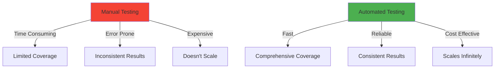
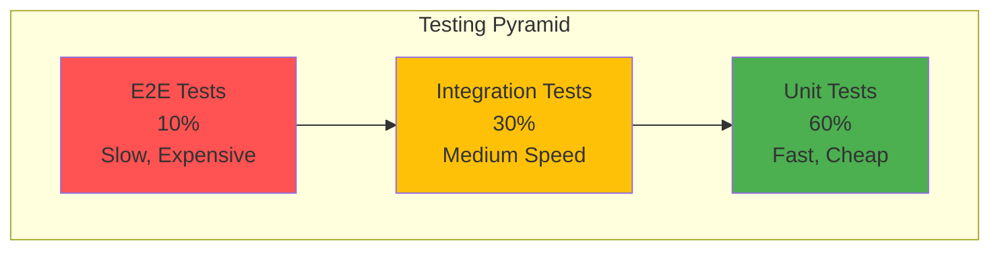

# Module 13: AI-Powered QA Automation

## Welcome to Quality Assurance Excellence

Quality assurance is the backbone of reliable software. In this module, you'll master automated testing strategies that combine traditional best practices with cutting-edge AI capabilities to ensure your code is production-ready.

## What You'll Learn

### Core Testing Fundamentals
- **Unit Testing**: Test individual functions and components in isolation
- **Integration Testing**: Verify that different parts of your system work together
- **End-to-End Testing**: Simulate real user workflows across your entire application
- **Visual Regression Testing**: Catch unintended UI changes automatically

### AI-Enhanced Testing
- **AI Test Generation**: Use AI to create comprehensive test cases
- **Intelligent Test Maintenance**: Automatically update tests when code changes
- **Smart Test Prioritization**: Run the most critical tests first
- **Anomaly Detection**: Identify unusual patterns in test results

### Professional QA Workflows
- **CI/CD Integration**: Automated testing in GitHub Actions
- **Code Coverage Analysis**: Ensure comprehensive test coverage
- **Mutation Testing**: Verify your tests actually catch bugs
- **Security Scanning**: Automated vulnerability detection

## Why QA Automation Matters

### Real-World Impact

**Without QA Automation:**
- Bugs reach production
- Customer dissatisfaction increases
- Development velocity slows
- Technical debt accumulates
- Team morale suffers

**With QA Automation:**
- Bugs caught before deployment
- Confidence in every release
- Rapid iteration cycles
- Maintainable codebase
- Happy developers and users

## The Testing Pyramid

**The Principle**: More unit tests (fast, cheap), fewer E2E tests (slow, expensive).

## Tools We'll Master

### Testing Frameworks
- **Vitest**: Lightning-fast unit testing for JavaScript/TypeScript
- **Jest**: Industry-standard JavaScript testing framework
- **pytest**: Python testing with powerful fixtures
- **Playwright**: Modern E2E testing across browsers
- **Cypress**: Developer-friendly E2E testing

### Quality Tools
- **Codecov**: Coverage reporting and analysis
- **SonarQube**: Code quality and security scanning
- **Stryker**: Mutation testing framework
- **Percy**: Visual regression testing
- **Lighthouse CI**: Performance and accessibility testing

### CI/CD Integration
- **GitHub Actions**: Automated workflow execution
- **Pre-commit hooks**: Local quality gates
- **Dependabot**: Automated dependency updates

## Module Structure

### Morning Session (3 hours)
1. **Introduction** (30 min) - QA fundamentals and AI testing
2. **Concepts** (45 min) - Testing strategies and best practices
3. **Hands-On** (60 min) - Set up testing frameworks
4. **Exercises** (45 min) - Write comprehensive test suites

### Your Project
Build a complete testing pipeline for a real-world application:
- Unit tests with 90%+ coverage
- Integration tests for critical flows
- E2E tests for user journeys
- Automated CI/CD pipeline
- Security scanning integration

## Success Metrics

By the end of this module, you'll have:
- ✅ A fully automated testing pipeline
- ✅ 90%+ code coverage across your projects
- ✅ Confidence to refactor without fear
- ✅ CI/CD workflows that prevent bad code from shipping
- ✅ Skills to implement QA in any tech stack

## Prerequisites

- Basic programming knowledge (JavaScript, Python, or similar)
- Git fundamentals
- Command line familiarity
- A GitHub account (for CI/CD integration)

## Let's Build Quality In

Quality isn't something you add at the end—it's built into every line of code from day one. Let's learn how to make testing effortless, automatic, and effective.

Ready to ensure your code works perfectly, every time? Let's dive in!

## Navigation
- Next: [Testing Concepts](01_concepts.md)
- [Back to Module Overview](README.md)
