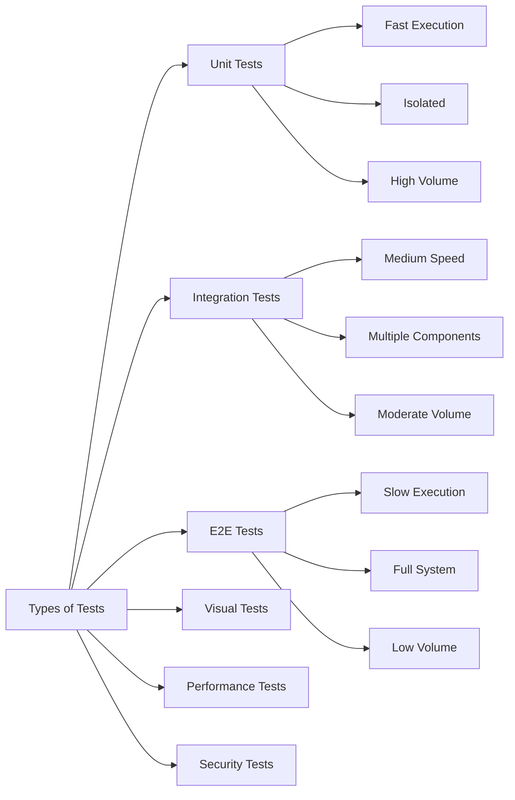
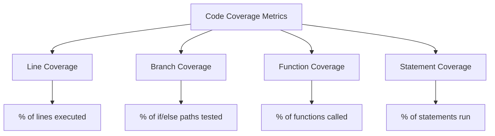
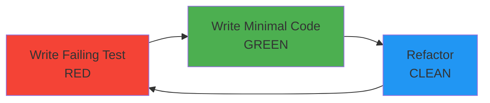

# Testing Concepts & Best Practices

## The Testing Landscape

### Types of Tests



### 1. Unit Tests

**Purpose**: Test individual functions, methods, or components in isolation.

**Characteristics**:
- Extremely fast (milliseconds)
- No external dependencies (database, API, file system)
- High volume (hundreds to thousands)
- Foundation of test suite

**Example - JavaScript/Vitest**:
```javascript
// src/utils/calculator.js
export function add(a, b) {
  return a + b;
}

export function divide(a, b) {
  if (b === 0) throw new Error('Division by zero');
  return a / b;
}

// tests/calculator.test.js
import { describe, it, expect } from 'vitest';
import { add, divide } from '../src/utils/calculator';

describe('Calculator', () => {
  describe('add', () => {
    it('should add two positive numbers', () => {
      expect(add(2, 3)).toBe(5);
    });

    it('should handle negative numbers', () => {
      expect(add(-2, 3)).toBe(1);
    });
  });

  describe('divide', () => {
    it('should divide two numbers', () => {
      expect(divide(10, 2)).toBe(5);
    });

    it('should throw error for division by zero', () => {
      expect(() => divide(10, 0)).toThrow('Division by zero');
    });
  });
});
```

**Example - Python/pytest**:
```python
# src/calculator.py
def add(a: int, b: int) -> int:
    return a + b

def divide(a: int, b: int) -> float:
    if b == 0:
        raise ValueError("Division by zero")
    return a / b

# tests/test_calculator.py
import pytest
from src.calculator import add, divide

def test_add_positive_numbers():
    assert add(2, 3) == 5

def test_add_negative_numbers():
    assert add(-2, 3) == 1

def test_divide():
    assert divide(10, 2) == 5.0

def test_divide_by_zero():
    with pytest.raises(ValueError, match="Division by zero"):
        divide(10, 0)
```

### 2. Integration Tests

**Purpose**: Test how multiple components work together.

**Characteristics**:
- Medium speed (seconds)
- May use test databases or mock services
- Moderate volume (dozens to hundreds)
- Verify component interactions

**Example - API Integration Test**:
```javascript
// tests/integration/api.test.js
import { describe, it, expect, beforeAll, afterAll } from 'vitest';
import request from 'supertest';
import { app } from '../src/server';
import { db } from '../src/database';

describe('User API Integration', () => {
  beforeAll(async () => {
    await db.migrate.latest();
    await db.seed.run();
  });

  afterAll(async () => {
    await db.migrate.rollback();
    await db.destroy();
  });

  it('should create a new user and retrieve it', async () => {
    // Create user
    const createResponse = await request(app)
      .post('/api/users')
      .send({
        name: 'John Doe',
        email: 'john@example.com'
      })
      .expect(201);

    const userId = createResponse.body.id;

    // Retrieve user
    const getResponse = await request(app)
      .get(`/api/users/${userId}`)
      .expect(200);

    expect(getResponse.body).toMatchObject({
      id: userId,
      name: 'John Doe',
      email: 'john@example.com'
    });
  });

  it('should handle user authentication flow', async () => {
    // Register
    await request(app)
      .post('/api/auth/register')
      .send({
        email: 'test@example.com',
        password: 'SecurePass123!'
      })
      .expect(201);

    // Login
    const loginResponse = await request(app)
      .post('/api/auth/login')
      .send({
        email: 'test@example.com',
        password: 'SecurePass123!'
      })
      .expect(200);

    expect(loginResponse.body.token).toBeDefined();

    // Access protected route
    await request(app)
      .get('/api/profile')
      .set('Authorization', `Bearer ${loginResponse.body.token}`)
      .expect(200);
  });
});
```

### 3. End-to-End (E2E) Tests

**Purpose**: Test complete user workflows from start to finish.

**Characteristics**:
- Slow execution (seconds to minutes)
- Real browser automation
- Low volume (critical user journeys only)
- Most expensive to maintain

**Example - Playwright E2E Test**:
```javascript
// tests/e2e/checkout.spec.js
import { test, expect } from '@playwright/test';

test.describe('E-commerce Checkout Flow', () => {
  test('should complete purchase from browsing to confirmation', async ({ page }) => {
    // Navigate to homepage
    await page.goto('https://example-shop.com');

    // Search for product
    await page.fill('[data-testid="search-input"]', 'laptop');
    await page.click('[data-testid="search-button"]');

    // Wait for results
    await page.waitForSelector('[data-testid="product-card"]');

    // Select first product
    await page.click('[data-testid="product-card"]:first-child');

    // Add to cart
    await page.click('[data-testid="add-to-cart"]');
    await expect(page.locator('[data-testid="cart-count"]')).toHaveText('1');

    // Go to cart
    await page.click('[data-testid="cart-icon"]');

    // Verify cart contents
    await expect(page.locator('[data-testid="cart-item"]')).toHaveCount(1);

    // Proceed to checkout
    await page.click('[data-testid="checkout-button"]');

    // Fill shipping information
    await page.fill('[name="name"]', 'John Doe');
    await page.fill('[name="email"]', 'john@example.com');
    await page.fill('[name="address"]', '123 Main St');
    await page.fill('[name="city"]', 'New York');
    await page.fill('[name="zip"]', '10001');

    // Fill payment information (using test card)
    await page.fill('[name="cardNumber"]', '4242424242424242');
    await page.fill('[name="expiry"]', '12/25');
    await page.fill('[name="cvv"]', '123');

    // Submit order
    await page.click('[data-testid="place-order"]');

    // Verify confirmation page
    await expect(page).toHaveURL(/\/order-confirmation/);
    await expect(page.locator('h1')).toContainText('Order Confirmed');

    // Verify confirmation email sent
    const orderNumber = await page.locator('[data-testid="order-number"]').textContent();
    expect(orderNumber).toMatch(/^ORD-\d+$/);
  });

  test('should handle payment failure gracefully', async ({ page }) => {
    // ... add product to cart ...

    // Use declining test card
    await page.fill('[name="cardNumber"]', '4000000000000002');

    await page.click('[data-testid="place-order"]');

    // Verify error message
    await expect(page.locator('[role="alert"]')).toContainText('Payment failed');

    // Verify cart still contains items
    await expect(page.locator('[data-testid="cart-item"]')).toHaveCount(1);
  });
});
```

### 4. Visual Regression Testing

**Purpose**: Catch unintended UI changes.

**Example - Percy Configuration**:
```javascript
// tests/visual/homepage.spec.js
import percySnapshot from '@percy/playwright';
import { test } from '@playwright/test';

test('homepage visual regression', async ({ page }) => {
  await page.goto('https://example.com');

  // Take full-page snapshot
  await percySnapshot(page, 'Homepage - Desktop');

  // Mobile viewport
  await page.setViewportSize({ width: 375, height: 667 });
  await percySnapshot(page, 'Homepage - Mobile');

  // Dark mode
  await page.emulateMedia({ colorScheme: 'dark' });
  await percySnapshot(page, 'Homepage - Dark Mode');

  // Interactive states
  await page.hover('[data-testid="nav-menu"]');
  await percySnapshot(page, 'Homepage - Menu Hover');
});
```

## Testing Best Practices

### AAA Pattern (Arrange, Act, Assert)

```javascript
test('user registration validates email format', async () => {
  // Arrange - Set up test data
  const invalidEmail = 'not-an-email';
  const userData = { email: invalidEmail, password: 'Pass123!' };

  // Act - Execute the function
  const result = await registerUser(userData);

  // Assert - Verify the outcome
  expect(result.success).toBe(false);
  expect(result.error).toContain('Invalid email format');
});
```

### Test Naming Conventions

**Bad**:
```javascript
test('test1', () => { ... });
test('user test', () => { ... });
```

**Good**:
```javascript
test('should return 401 when user is not authenticated', () => { ... });
test('should calculate total price including tax and shipping', () => { ... });
test('should render error message when form validation fails', () => { ... });
```

### Test Independence

**Bad - Tests depend on each other**:
```javascript
let userId;

test('creates user', async () => {
  userId = await createUser({ name: 'John' });
});

test('updates user', async () => {
  await updateUser(userId, { name: 'Jane' }); // Fails if first test fails
});
```

**Good - Each test is independent**:
```javascript
test('creates user', async () => {
  const userId = await createUser({ name: 'John' });
  expect(userId).toBeDefined();
});

test('updates user', async () => {
  const userId = await createUser({ name: 'John' });
  const updated = await updateUser(userId, { name: 'Jane' });
  expect(updated.name).toBe('Jane');
});
```

## Code Coverage

### Understanding Coverage Metrics



**Coverage Report Example**:
```bash
----------------------|---------|----------|---------|---------|
File                  | % Stmts | % Branch | % Funcs | % Lines |
----------------------|---------|----------|---------|---------|
All files             |   92.3  |   87.5   |   95.0  |   92.1  |
 src/                 |   95.0  |   90.0   |   100   |   94.8  |
  user.js             |   100   |   100    |   100   |   100   |
  auth.js             |   90.0  |   80.0   |   100   |   89.7  |
 src/utils/           |   88.5  |   83.3   |   87.5  |   88.2  |
  helpers.js          |   85.0  |   75.0   |   80.0  |   84.6  |
  validators.js       |   92.0  |   91.7   |   95.0  |   92.0  |
----------------------|---------|----------|---------|---------|
```

**Target**: Aim for 80%+ coverage, but prioritize critical paths.

### Coverage Configuration

**Vitest**:
```javascript
// vitest.config.js
export default {
  test: {
    coverage: {
      provider: 'v8',
      reporter: ['text', 'json', 'html', 'lcov'],
      exclude: [
        'node_modules/',
        'tests/',
        '**/*.config.js',
        '**/types.ts'
      ],
      thresholds: {
        lines: 80,
        functions: 80,
        branches: 75,
        statements: 80
      }
    }
  }
};
```

## Mutation Testing

**Concept**: Verify that your tests actually catch bugs by intentionally introducing bugs (mutations).

**Example - Stryker Configuration**:
```javascript
// stryker.config.json
{
  "mutator": "javascript",
  "testRunner": "vitest",
  "reporters": ["html", "clear-text", "progress"],
  "coverageAnalysis": "perTest",
  "thresholds": {
    "high": 80,
    "low": 60,
    "break": 50
  }
}
```

**How it works**:
1. Original code: `if (age >= 18)` → Passes tests
2. Mutation: `if (age > 18)` → Should fail tests
3. If tests still pass, you have a gap in coverage

## AI-Powered Testing

### AI Test Generation

**Using ChatGPT/Claude for test creation**:

```javascript
// Prompt: "Generate comprehensive unit tests for this function"
function validatePassword(password) {
  if (password.length < 8) return { valid: false, reason: 'Too short' };
  if (!/[A-Z]/.test(password)) return { valid: false, reason: 'No uppercase' };
  if (!/[a-z]/.test(password)) return { valid: false, reason: 'No lowercase' };
  if (!/[0-9]/.test(password)) return { valid: false, reason: 'No number' };
  if (!/[!@#$%^&*]/.test(password)) return { valid: false, reason: 'No special char' };
  return { valid: true };
}

// AI-generated tests
describe('validatePassword', () => {
  it('should reject passwords shorter than 8 characters', () => {
    expect(validatePassword('Pass1!')).toEqual({
      valid: false,
      reason: 'Too short'
    });
  });

  it('should reject passwords without uppercase letters', () => {
    expect(validatePassword('password1!')).toEqual({
      valid: false,
      reason: 'No uppercase'
    });
  });

  it('should accept valid passwords', () => {
    expect(validatePassword('SecurePass123!')).toEqual({ valid: true });
  });

  // AI identifies edge cases
  it('should handle empty strings', () => {
    expect(validatePassword('')).toEqual({
      valid: false,
      reason: 'Too short'
    });
  });

  it('should handle null input', () => {
    expect(() => validatePassword(null)).toThrow();
  });
});
```

### AI Test Maintenance

Tools like **GitHub Copilot** can:
- Auto-update tests when code changes
- Suggest missing test cases
- Generate mock data
- Refactor test code

## Test-Driven Development (TDD)

### Red-Green-Refactor Cycle



**Example TDD Session**:

```javascript
// Step 1: RED - Write failing test
test('should format currency correctly', () => {
  expect(formatCurrency(1234.56)).toBe('$1,234.56');
});
// ❌ ReferenceError: formatCurrency is not defined

// Step 2: GREEN - Minimal implementation
function formatCurrency(amount) {
  return '$' + amount.toFixed(2);
}
// ❌ Expected: "$1,234.56", Received: "$1234.56"

// Step 3: GREEN - Make it pass
function formatCurrency(amount) {
  return '$' + amount.toLocaleString('en-US', {
    minimumFractionDigits: 2,
    maximumFractionDigits: 2
  });
}
// ✅ Test passes

// Step 4: REFACTOR - Add more tests and edge cases
test('should handle negative amounts', () => {
  expect(formatCurrency(-100)).toBe('-$100.00');
});

test('should handle zero', () => {
  expect(formatCurrency(0)).toBe('$0.00');
});
```

## Key Takeaways

1. **Follow the Testing Pyramid**: More unit tests, fewer E2E tests
2. **Test Behavior, Not Implementation**: Focus on what code does, not how
3. **Keep Tests Independent**: Each test should run in isolation
4. **Use Descriptive Names**: Test names should explain the scenario
5. **Aim for 80%+ Coverage**: But don't obsess over 100%
6. **Leverage AI**: For test generation and maintenance
7. **Practice TDD**: Write tests first, code second
8. **Run Tests Frequently**: Catch issues early

## Navigation
- Previous: [Introduction](00_introduction.md)
- Next: [Hands-On Setup](02_hands_on.md)
- [Back to Module Overview](README.md)
