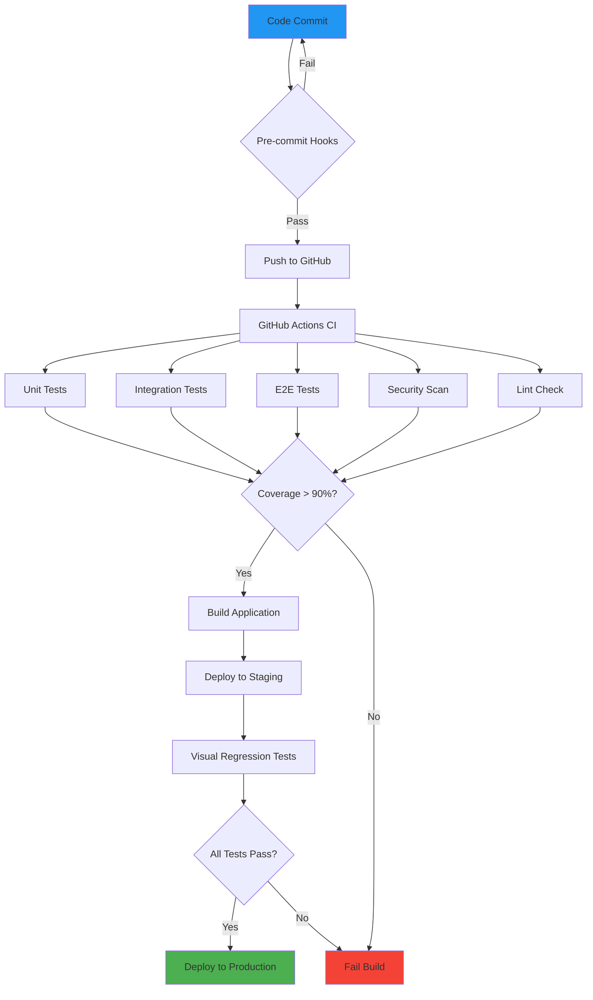

# Project: Complete QA Automation Pipeline

## Overview

Build a production-ready testing pipeline for a real-world application with comprehensive test coverage, CI/CD integration, and quality gates.

## Project Requirements



## Phase 1: Test Suite (60 points)

### Unit Tests (20 points)
- ✅ 90%+ code coverage
- ✅ All edge cases covered
- ✅ Fast execution (< 5 seconds)
- ✅ No flaky tests

### Integration Tests (20 points)
- ✅ API endpoint testing
- ✅ Database integration
- ✅ External service mocking
- ✅ Error handling verification

### E2E Tests (20 points)
- ✅ Critical user journeys
- ✅ Cross-browser testing
- ✅ Mobile responsive tests
- ✅ Accessibility checks

## Phase 2: CI/CD Pipeline (25 points)

### GitHub Actions Workflow
```yaml
name: Production CI/CD

on:
  push:
    branches: [main]
  pull_request:
    branches: [main]

jobs:
  quality-gates:
    name: Quality Gates
    runs-on: ubuntu-latest
    steps:
      - uses: actions/checkout@v4
      - uses: actions/setup-node@v4
        with:
          node-version: '20.x'
          cache: 'npm'

      - name: Install dependencies
        run: npm ci

      - name: Type check
        run: npm run typecheck

      - name: Lint
        run: npm run lint

      - name: Security audit
        run: npm audit --audit-level=moderate

      - name: Unit tests with coverage
        run: npm run test:coverage

      - name: Upload coverage
        uses: codecov/codecov-action@v3
        with:
          files: ./coverage/lcov.info

      - name: Integration tests
        run: npm run test:integration

      - name: E2E tests
        run: |
          npx playwright install --with-deps
          npm run test:e2e

      - name: Mutation testing
        run: npx stryker run

      - name: Performance tests
        run: npm run test:performance

  build:
    needs: quality-gates
    runs-on: ubuntu-latest
    steps:
      - uses: actions/checkout@v4
      - uses: actions/setup-node@v4
      - run: npm ci
      - run: npm run build

      - name: Upload artifacts
        uses: actions/upload-artifact@v3
        with:
          name: dist
          path: dist/
```

### Quality Gates Checklist
- [ ] Code coverage ≥ 90%
- [ ] Mutation score ≥ 80%
- [ ] No high-severity security vulnerabilities
- [ ] All linting rules pass
- [ ] Type checks pass
- [ ] All tests green
- [ ] Build successful

## Phase 3: Quality Tools (15 points)

### Coverage Reporting
```javascript
// vitest.config.js
export default {
  test: {
    coverage: {
      provider: 'v8',
      reporter: ['text', 'json-summary', 'html', 'lcov'],
      statements: 90,
      branches: 85,
      functions: 90,
      lines: 90,
      exclude: [
        '**/*.config.{js,ts}',
        '**/dist/**',
        '**/node_modules/**',
        '**/*.test.{js,ts}'
      ]
    }
  }
};
```

### Mutation Testing
- Verify tests catch real bugs
- Fix surviving mutants
- Achieve 80%+ mutation score

### Performance Monitoring
```javascript
// tests/performance/lighthouse.test.js
import { playAudit } from 'playwright-lighthouse';
import { test } from '@playwright/test';

test('Lighthouse performance audit', async ({ page, context }) => {
  await page.goto('http://localhost:3000');

  await playAudit({
    page,
    port: 9222,
    thresholds: {
      performance: 90,
      accessibility: 100,
      'best-practices': 90,
      seo: 90
    }
  });
});
```

## Deliverables

### 1. Complete Test Suite
```bash
task-manager/
├── tests/
│   ├── unit/
│   │   ├── validators.test.js
│   │   ├── Task.test.js
│   │   └── helpers.test.js
│   ├── integration/
│   │   ├── api.test.js
│   │   └── database.test.js
│   ├── e2e/
│   │   ├── tasks.spec.js
│   │   ├── auth.spec.js
│   │   └── search.spec.js
│   └── performance/
│       └── lighthouse.test.js
```

### 2. CI/CD Configuration
- `.github/workflows/ci.yml`
- `.github/workflows/deploy.yml`
- Quality gate checks
- Automated deployments

### 3. Documentation
Create `docs/testing.md`:
```markdown
# Testing Strategy

## Test Coverage Goals
- Unit: 95%+
- Integration: 90%+
- E2E: Critical paths only
- Mutation: 80%+

## Running Tests Locally
\`\`\`bash
npm test              # All tests
npm run test:unit     # Unit only
npm run test:int      # Integration only
npm run test:e2e      # E2E only
npm run test:mutation # Mutation testing
\`\`\`

## CI/CD Pipeline
All PRs must pass:
1. Linting
2. Type checking
3. Security audit
4. All test suites
5. Coverage thresholds
6. Mutation testing

## Adding New Tests
[Instructions for team...]
```

## Grading Rubric

| Category | Points | Criteria |
|----------|--------|----------|
| **Unit Tests** | 20 | 90%+ coverage, all edge cases, fast |
| **Integration Tests** | 20 | API, database, error handling |
| **E2E Tests** | 20 | Critical flows, cross-browser |
| **CI/CD Pipeline** | 25 | Complete automation, quality gates |
| **Quality Tools** | 15 | Coverage, mutation, performance |
| **Total** | **100** | |

### Bonus Points (10)
- Visual regression testing (+3)
- Accessibility testing (+3)
- Performance budgets (+2)
- Comprehensive documentation (+2)

## Success Criteria

Your project is complete when:
1. ✅ All tests pass locally
2. ✅ CI/CD pipeline is green
3. ✅ Coverage meets thresholds
4. ✅ No critical security issues
5. ✅ Mutation score ≥ 80%
6. ✅ Documentation is complete
7. ✅ Team can run tests easily

## Submission

Submit via GitHub:
1. Create a repository: `qa-automation-project`
2. Implement all requirements
3. Ensure CI/CD passes
4. Add screenshot of green pipeline
5. Submit repository URL

## Real-World Application

This project simulates a production environment where:
- Every commit triggers automated tests
- Code reviews include test coverage
- Deployments require all tests to pass
- Quality gates prevent bad code from shipping
- Team confidence in releases is high

## Navigation
- Previous: [Exercises](03_exercises.md)
- Next: [Assessment](05_assessment.md)
- [Back to Module Overview](README.md)
