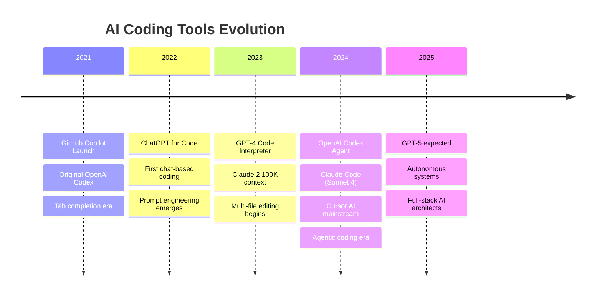
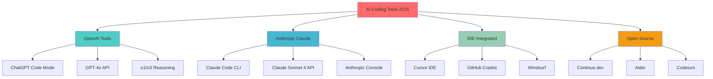
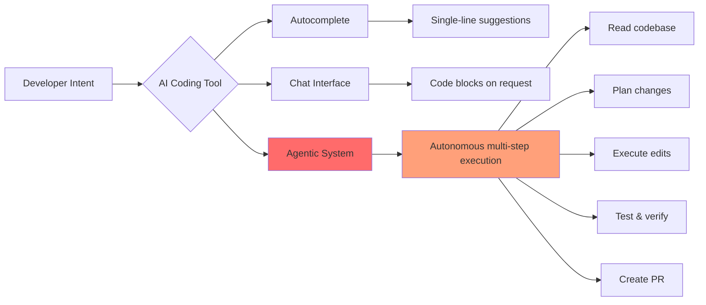
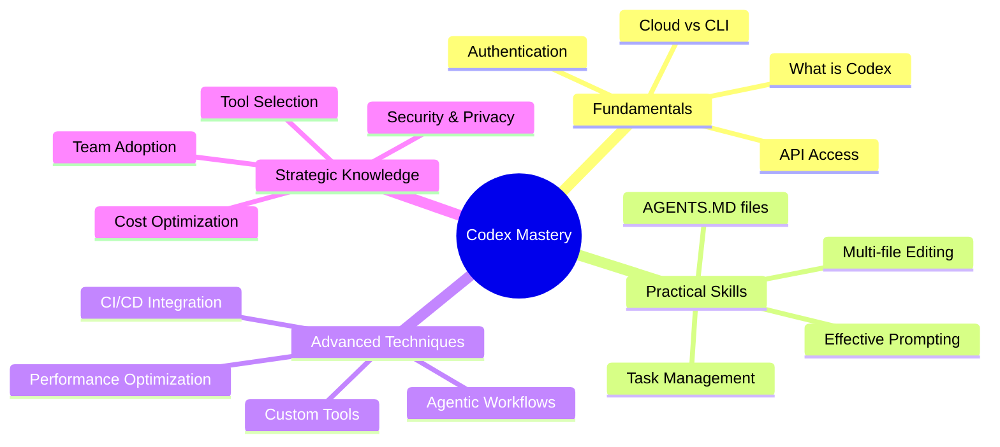
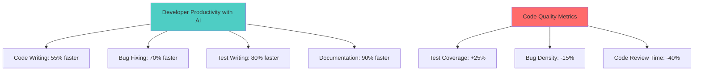

# Chapter 0: Introduction to AI-Powered Software Engineering & OpenAI Codex

> **2024-2025 Update:** AI coding assistants have evolved from autocomplete tools to autonomous agentic systems capable of implementing complex features, refactoring entire codebases, and even making architectural decisions.

## The AI Coding Revolution

Software development is experiencing its most significant transformation since the introduction of high-level programming languages. AI-powered code generation, once a research curiosity, has become a production-ready technology reshaping how we build software.

### The Evolution Timeline

> **💡 Latest Development (Jan 2025):** OpenAI's Codex ecosystem has evolved beyond the original Codex API (deprecated 2023) into integrated tools: ChatGPT with code capabilities, GPT-4o for coding tasks, and the emerging o1/o3 reasoning models. Meanwhile, Claude Code CLI and Cursor AI have emerged as leading alternatives, with Claude Sonnet 4 achieving 92.3% on HumanEval.

## What is "Codex" in 2025?

**Important Context:** The original OpenAI Codex API was deprecated in March 2023. However, the term "Codex" now refers to the broader ecosystem of OpenAI coding capabilities:

- **ChatGPT Code Mode**: GPT-4o and o1 models with coding specialization
- **API Access**: GPT-4o, o1-preview, o1-mini for programmatic code generation
- **GitHub Copilot**: Powered by GPT-4o (not the original Codex)
- **Third-party Tools**: Cursor, Continue.dev, Aider using OpenAI models

This workshop covers the modern "Codex ecosystem" - AI systems that translate natural language into functional code. These tools operate as **agentic systems**—virtual software engineers capable of:

### Core Capabilities

1. **Multi-File Code Generation**
   - Scaffold entire projects from natural language descriptions
   - Maintain consistency across dozens of interconnected files
   - Understand architectural patterns and best practices

2. **Intelligent Refactoring**
   - Analyze codebases for improvement opportunities
   - Apply refactoring patterns safely across multiple files
   - Update dependencies and fix breaking changes

3. **Bug Detection and Repair**
   - Identify logic errors, security vulnerabilities, and performance issues
   - Propose fixes with explanations
   - Generate comprehensive test cases

4. **Code Review and Documentation**
   - Review pull requests with detailed feedback
   - Generate documentation from code
   - Explain complex algorithms in plain language

5. **Test Generation**
   - Create unit, integration, and end-to-end tests
   - Achieve high code coverage automatically
   - Generate test data and mocks

### The Modern AI Coding Ecosystem (2025)

### From Autocomplete to Agentic Coding

The transformation from simple autocomplete to autonomous agents represents a fundamental shift in how AI assists developers:

| Generation | Era | Capability | Example Tools |
|------------|-----|------------|---------------|
| **1.0** | Tab Completion (2021) | Single-line suggestions | GitHub Copilot, Tabnine |
| **2.0** | Chat-Based (2022-23) | Multi-line code blocks | ChatGPT, Claude |
| **3.0** | Multi-File (2023-24) | Cross-file editing | Cursor, Claude Code |
| **4.0** | Agentic (2024-25) | Autonomous task execution | Codex Agent, Devin |

> "We started thinking about like oh what if instead of a human pair programming with a human it was like a human pair programming with an AI... this is an agent that is good at like independent software engineering work and like the more we leaned into that the more things started to feel really special."
>
> **— Alexander, OpenAI Product Team** (Workshop Transcript)

## The Modern AI Coding Landscape

OpenAI Codex exists within a competitive ecosystem of AI coding tools, each with distinct strengths:

### Major Players Comparison (January 2025)

| Tool | Best For | Strengths | Pricing |
|------|----------|-----------|---------|
| **ChatGPT (GPT-4o)** | General coding, brainstorming | Versatile, web access, fast | $20/mo Plus |
| **ChatGPT (o1/o3)** | Complex reasoning, algorithms | Deep thinking, PhD-level math | $200/mo Pro |
| **Claude Code CLI** | Terminal workflows, long context | 200K tokens, artifact mode, tool use | $20/mo + API |
| **Cursor AI** | IDE experience | Native VS Code, Composer, fast | $20/mo Pro |
| **GitHub Copilot** | GitHub integration | IDE native, enterprise features | $10-39/mo |
| **Windsurf** | Flow state coding | Cascade multi-file editing | $15/mo |
| **Continue.dev** | Open source, privacy | Self-hosted, model agnostic | Free (OSS) |
| **Aider** | Git-native CLI | Efficient tokens, auto-commits | Pay-per-use |

### Architecture Patterns

## Who Should Use This Guide?

This comprehensive tutorial is designed for:

### Primary Audiences

1. **Software Engineers (All Levels)**
   - Junior developers seeking to accelerate learning
   - Mid-level engineers improving productivity
   - Senior engineers exploring AI-assisted architecture

2. **Technical Leaders**
   - Engineering managers evaluating AI tools
   - CTOs making strategic technology decisions
   - Team leads implementing AI workflows

3. **Specialized Developers**
   - Full-stack developers managing complexity
   - DevOps engineers automating infrastructure
   - Data scientists building ML pipelines
   - Mobile developers across platforms

### What You'll Master

This guide provides a comprehensive learning path:

### Learning Outcomes

By completing this workshop, you will be able to:

1. ✅ **Setup & Configure** - Get Codex running in Cloud, CLI, and API modes
2. ✅ **Prompt Effectively** - Craft prompts that generate production-quality code
3. ✅ **Manage Tasks** - Break down complex projects into AI-executable tasks
4. ✅ **Review & Iterate** - Critically evaluate AI-generated code
5. ✅ **Compare Tools** - Make informed decisions between Codex and alternatives
6. ✅ **Handle Edge Cases** - Navigate limitations, errors, and security concerns
7. ✅ **Scale Adoption** - Roll out AI coding tools across teams

## The Agentic Mindset

Using modern AI coding tools requires a shift in how you think about development:

### Traditional vs. Agentic Approach

| Traditional Coding | Agentic Coding |
|-------------------|----------------|
| Write code line by line | Describe desired outcome |
| Manual file navigation | AI navigates codebase |
| Incremental refactoring | Wholesale transformations |
| Manual test writing | Automated test generation |
| Individual contributor | Human-AI team |

> "You must have an abundance mindset and you must think of it as like not using your time to explore things... the way we see people who love Codex the most using it is they don't think for like maybe 30 seconds max about their prompt... you just send it off."
>
> **— Josh, OpenAI Team** (Workshop Transcript)

### The Delegation Framework

Think of AI coding assistants as junior developers who:

- ✅ Excel at pattern recognition and boilerplate
- ✅ Never get tired of repetitive tasks
- ✅ Can process massive codebases instantly
- ⚠️ Need clear instructions and context
- ⚠️ Require review and validation
- ⚠️ May miss subtle business logic

## Real-World Impact Metrics

### Productivity Gains (Industry Data, 2024)

### Use Case Distribution

According to OpenAI's 2024 usage data:

- **Feature Implementation:** 45%
- **Bug Fixes:** 25%
- **Refactoring:** 15%
- **Test Generation:** 10%
- **Documentation:** 5%

## What This Guide Covers

### Comprehensive Chapter Overview

1. **Chapter 1: The Codex Ecosystem** - Deep dive into Cloud Agent vs. CLI
2. **Chapter 2: Getting Started** - Setup, authentication, and first steps
3. **Chapter 3: Mastering Codex** - Prompting, AGENTS.MD, task management
4. **Chapter 4: Practical Applications** - 50+ real-world examples
5. **Chapter 5: Broader Landscape** - Competitive analysis and tool selection
6. **Chapter 6: Challenges** - Limitations, security, ethics
7. **Chapter 7: Best Practices** - Expert insights and proven patterns
8. **Chapter 8: Future Outlook** - Emerging trends and what's next

### Hands-On Exercises

Each chapter includes:

- 💻 **Code Examples** - Copy-paste ready snippets
- 🎯 **Practice Tasks** - Structured exercises with solutions
- 📊 **Comparison Tables** - Quick reference guides
- 🎨 **Architecture Diagrams** - Visual understanding of concepts
- 💡 **Pro Tips** - Expert insights from real usage

## The Future is Agentic

As we move into 2025, the trend is clear: AI coding tools are becoming more autonomous, more capable, and more integrated into every aspect of software development. OpenAI Codex represents the cutting edge of this transformation.

> "It's kind of like starts off as better chat but then when you can give it tools you can actually like make it an agent right like an agent is like a reasoning model with tools and an environment, guardrails and then maybe like training on specific tasks."
>
> **— Alexander, OpenAI** (Workshop Transcript)

The developers who master these tools today will define how software is built tomorrow.

---

## Quick Start Checklist

Before diving into Chapter 1, ensure you have:

- [ ] OpenAI account created (free tier available)
- [ ] Basic understanding of Git and command-line tools
- [ ] Code editor installed (VS Code recommended)
- [ ] Open mind about AI-assisted development
- [ ] Willingness to experiment and iterate

---

**Next:** [Chapter 1: Understanding the Codex Ecosystem](./01_understanding_the_codex_ecosystem.md)

---

*Last Updated: January 2025 | OpenAI GPT-4o & o1 | Claude Sonnet 4 | Comprehensive AI Coding Guide*
